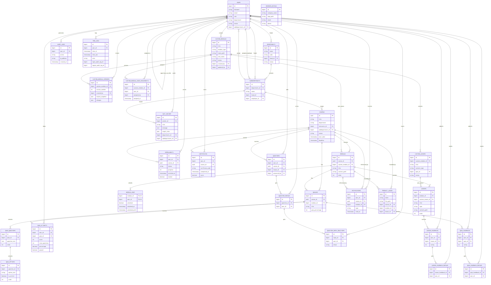
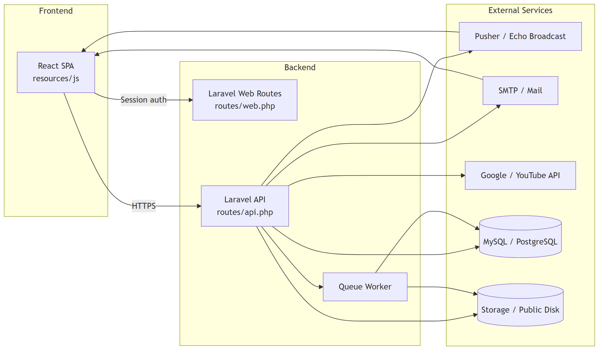
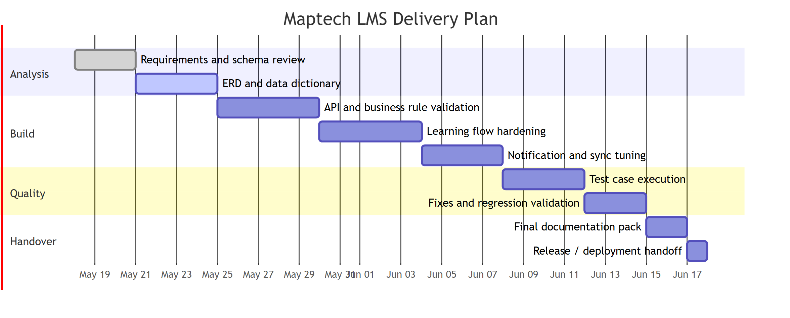
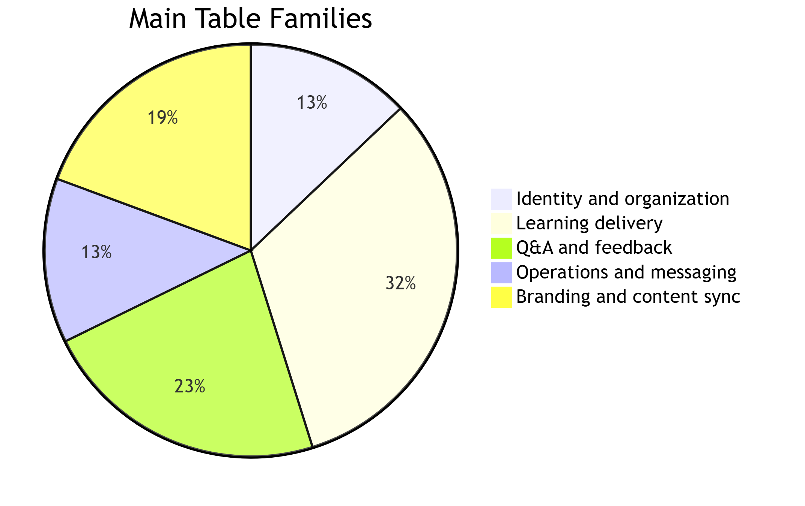
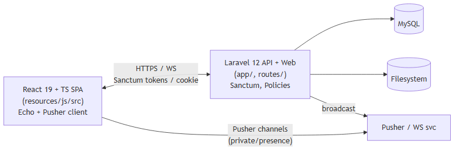
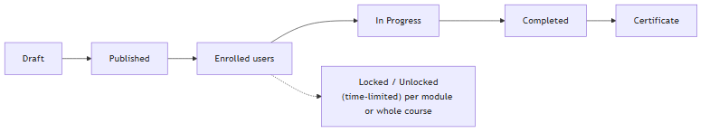
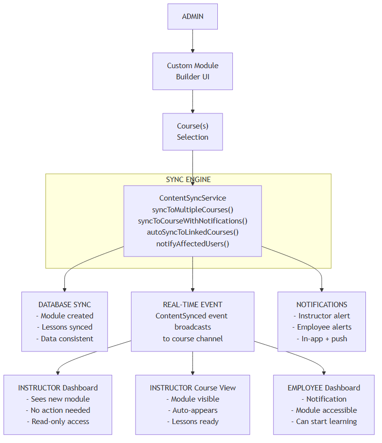

# Maptech LMS - Compiled Full Documentation

> Full-detail single-file compilation of the project documentation.
> This file contains verbatim content from all major docs so it can be copied into Word as one document.

## Included Sources
1. System Analysis Pack
2. System Documentation
3. User Manual
4. Content Sync Design
5. Custom UI Components Guide
6. Codebase Exploration Report

---

# Part 1 - System Analysis Pack

Source file: Documentation\SYSTEM_ANALYSIS_PACK.md

# Maptech LMS System Analysis Pack

> Generated from the current Laravel codebase, migrations, models, and route surface in this repository.
> Scope: core business entities, operational tables, and the major application flows exposed by the system.

## 1. System Snapshot

Maptech LMS is a role-based learning management platform with three primary user groups:

- Admin: manages users, departments, courses, custom modules, branding, logs, and notifications.
- Instructor: manages assigned courses, content, quizzes, and learner support.
- Employee: enrolls in courses, consumes lessons, takes quizzes, receives certificates, and tracks progress.

The platform also includes real-time notifications, content synchronization, audit logging, time tracking, certificate generation, recovery-key password reset, and custom UI component modules.

## 2. Core Domain Areas

| Domain | Main Tables |
|---|---|
| Identity and organization | users, departments, subdepartments, user_subdepartment |
| Learning delivery | courses, modules, lessons, enrollments, module_user, quizzes, quiz_questions, quiz_options, quiz_attempts, certificates |
| Q&A and feedback | questions, question_replies, question_reply_reactions, lesson_feedbacks, lesson_feedback_replies, quiz_feedbacks, quiz_feedback_replies |
| Operations and messaging | notifications, audit_logs, time_logs, sent_history |
| Branding and content sync | business_details, product_logos, custom_modules, custom_lessons, custom_module_versions, custom_module_user_assignments |

## 3. ERD



## 4. Data Dictionary

### 4.1 Identity and Organization

| Table | Purpose | Key Columns | Notes |
|---|---|---|---|
| users | System accounts and role-based access | fullname, email, password, role, department, subdepartment_id, company_role, personal_gmail, status, profile_picture, signature_path, recovery_key_hash | Supports Admin, Instructor, and Employee roles. |
| departments | Top-level business divisions | name, code, head_id, status, description, employee_count, course_count | Head must be an Admin or Instructor. |
| subdepartments | Department subdivisions | department_id, name, description, head_id, employee_id | Can have both a head and a direct employee owner. |
| user_subdepartment | Instructor-to-subdepartment assignment bridge | user_id, subdepartment_id | Many-to-many relationship for instructors and subdepartments. |

### 4.2 Learning Delivery

| Table | Purpose | Key Columns | Notes |
|---|---|---|---|
| courses | Training units owned by a department and instructor | id, title, description, department, subdepartment_id, instructor_id, status, start_date, deadline, logo_path | Uses UUID primary key. |
| modules | Ordered sections within a course | id, course_id, custom_module_id, title, description, content_path, logo_path, order | Can be synced from a custom module. |
| lessons | Atomic learning content inside a module | id, module_id, custom_lesson_id, title, type, text_content, content_path, duration, file_size, status, order | Supports text, video, file, and linked content. |
| enrollments | User enrollment and progress tracking | user_id, course_id, status, progress, enrolled_at, locked | Unique per user-course pair. |
| module_user | Manual unlock pivot for users and modules | module_id, user_id, unlocked, unlocked_at, unlocked_until | Controls time-limited unlock rules. |
| quizzes | Quiz definition and passing threshold | course_id, module_id, title, description, pass_percentage | One module can have one quiz. |
| quiz_questions | Questions within a quiz | quiz_id, question_text, image_path, video_path, order | Questions are ordered per quiz. |
| quiz_options | Answer choices per quiz question | question_id, option_text, is_correct, order | Stores correctness at the option level. |
| quiz_attempts | Learner quiz submissions | user_id, quiz_id, score, total_questions, percentage, passed | Drives progress and certificate generation. |
| certificates | Completion evidence for a course | user_id, course_id, certificate_code, completed_at, score, logo_path | Generated automatically when completion criteria are met. |

### 4.3 Q&A and Feedback

| Table | Purpose | Key Columns | Notes |
|---|---|---|---|
| questions | Course and lesson questions from users | user_id, course_id, lesson_id, question, answer, answered_by, answered_at | Supports instructor response tracking. |
| question_replies | Conversation thread under a question | question_id, user_id, message | Ordered in ascending creation order. |
| question_reply_reactions | Emoji reactions to replies | reply_id, user_id, emoji | Unique per reply, user, emoji triplet. |
| lesson_feedbacks | Lesson-level learner ratings and comments | user_id, lesson_id, rating, comment | Unique per user and lesson. |
| lesson_feedback_replies | Responses to lesson feedback | lesson_feedback_id, user_id, comment | Used by instructors/admins. |
| quiz_feedbacks | Quiz-level learner ratings and comments | user_id, quiz_id, rating, comment | Feedback capture after quiz interactions. |
| quiz_feedback_replies | Responses to quiz feedback | quiz_feedback_id, user_id, comment | Used for follow-up discussion. |

### 4.4 Operations and Messaging

| Table | Purpose | Key Columns | Notes |
|---|---|---|---|
| notifications | In-app notification feed | user_id, course_id, module_id, type, title, message, data, read_at | Broadcasts real-time updates and unread counts. |
| audit_logs | Immutable security and activity log | user_id, action, ip_address, session_key, created_at, deleted_at | Soft deletes supported for retention management. |
| time_logs | Punch-in / punch-out tracking | user_id, session_key, login_audit_log_id, logout_audit_log_id, time_in, time_out, note, archived | Linked to audit logs for session traceability. |
| sent_history | Announcement delivery history | sender_id, title, message, target, announcement_mode, data, target_roles, department_id, subdepartment_id, recipients_count, deleted_at | Keeps recent sends with retention trimming. |

### 4.5 Branding and Content Sync

| Table | Purpose | Key Columns | Notes |
|---|---|---|---|
| business_details | Organization branding and contact profile | company_name, logo_path, email, phone, mobile_phone, country, address, website, vat_reg_tin | Used in certificate and business identity screens. |
| product_logos | Course/module/lesson logo mappings | name, file_path, course_id, module_id, lesson_id | Legacy-compatible branding fallback. |
| custom_modules | Reusable admin-authored content blocks | title, module_type, route_path, icon_name, component_config, category, tags, thumbnail_path, status, order, created_by, updated_by, version | Supports learning modules and admin-only UI components. |
| custom_lessons | Lesson assets within a custom module | custom_module_id, title, description, content_type, text_content, content_path, content_url, file_name, file_type, file_size, duration, quiz_id, order, status | Can map to a quiz or external link. |
| custom_module_versions | Version history for custom modules | custom_module_id, version_number, title, description, lessons_snapshot, changes, created_by, created_at | Stores snapshots for audit and rollback. |
| custom_module_user_assignments | Assignment bridge for custom module access | custom_module_id, user_id, assigned_by, assigned_at | Tracks who assigned the module and when. |

## 5. Business Requirements

| BR ID | Requirement | Primary Actors | Outcome |
|---|---|---|---|
| BR-01 | The system must authenticate users and route them by role. | Admin, Instructor, Employee | Secure access to the correct dashboard and APIs. |
| BR-02 | The system must support department and subdepartment hierarchy management. | Admin | Organize users and training scope by business structure. |
| BR-03 | The system must allow instructors and admins to create and manage courses, modules, and lessons. | Admin, Instructor | Provide structured learning content. |
| BR-04 | The system must track enrollments, progress, and course completion. | Admin, Instructor, Employee | Show current learning status and completion progress. |
| BR-05 | The system must support quizzes, scoring, and pass/fail evaluation. | Admin, Instructor, Employee | Measure learning mastery. |
| BR-06 | The system must generate certificates automatically upon completion. | Employee, Admin | Provide proof of course completion. |
| BR-07 | The system must support learner Q&A and feedback workflows. | Instructor, Employee | Enable support and continuous improvement. |
| BR-08 | The system must provide real-time notifications and content sync. | Admin, Instructor, Employee | Keep users updated without refresh cycles. |
| BR-09 | The system must record audit logs and time logs for accountability. | Admin, Employee | Maintain compliance and session traceability. |
| BR-10 | The system must support custom modules, versioning, and UI components. | Admin | Allow reusable content and admin-only UI customization. |
| BR-11 | The system must support OTP and recovery-key password reset. | All users | Recover access securely. |
| BR-12 | The system must store branding details and logo mappings for certificates and content. | Admin | Keep organization branding consistent. |

## 6. Requirement List

| FR ID | Functional Requirement | Related Tables |
|---|---|---|
| FR-01 | Users can log in, log out, and obtain an authenticated session or token. | users, personal_access_tokens, sessions |
| FR-02 | The system can enforce role-based authorization across pages and APIs. | users, departments, subdepartments |
| FR-03 | Admin can create, update, and delete departments and subdepartments. | departments, subdepartments |
| FR-04 | Admin and instructors can create, update, and manage courses. | courses, users |
| FR-05 | Courses can contain ordered modules and lessons. | courses, modules, lessons |
| FR-06 | Employees can enroll in courses and see progress status. | enrollments, courses |
| FR-07 | Modules can be manually unlocked for users and can also have unlock windows. | module_user, enrollments |
| FR-08 | Courses can contain quizzes with ordered questions and options. | quizzes, quiz_questions, quiz_options |
| FR-09 | Quiz attempts are recorded and can be used to determine course progress. | quiz_attempts, enrollments |
| FR-10 | Certificates are generated when a course is completed. | certificates, quiz_attempts, quizzes |
| FR-11 | Users can ask questions and receive threaded replies and reactions. | questions, question_replies, question_reply_reactions |
| FR-12 | Users can submit lesson and quiz feedback. | lesson_feedbacks, lesson_feedback_replies, quiz_feedbacks, quiz_feedback_replies |
| FR-13 | Notifications are created and updated in real time. | notifications |
| FR-14 | Audit actions and time logs are stored with timezone-aware timestamps. | audit_logs, time_logs |
| FR-15 | Admins can create and sync custom modules to courses. | custom_modules, custom_lessons, custom_module_versions, modules, lessons |
| FR-16 | Admin-only UI component modules can be published into the sidebar. | custom_modules |
| FR-17 | The system stores business branding and logo assets. | business_details, product_logos |
| FR-18 | Announcement history is retained and automatically cleaned up when limits are exceeded. | sent_history |
| FR-19 | Password reset must support OTP and recovery-key flows. | password_reset_tokens, users |
| FR-20 | The system must expose department and course data for dashboards and content pages. | departments, courses, modules, enrollments |

## 7. RTM

| BR ID | Mapped FR IDs | Main Tables | Suggested Test Cases |
|---|---|---|---|
| BR-01 | FR-01, FR-02 | users, sessions, personal_access_tokens | TC-01, TC-02 |
| BR-02 | FR-03 | departments, subdepartments | TC-03 |
| BR-03 | FR-04, FR-05 | courses, modules, lessons | TC-04 |
| BR-04 | FR-06, FR-07, FR-09 | enrollments, module_user, quiz_attempts | TC-05, TC-06 |
| BR-05 | FR-08, FR-09, FR-10 | quizzes, quiz_questions, quiz_options, quiz_attempts, certificates | TC-06, TC-07 |
| BR-06 | FR-11, FR-12 | questions, replies, feedback tables | TC-08 |
| BR-07 | FR-13 | notifications | TC-09 |
| BR-08 | FR-14 | audit_logs, time_logs | TC-10 |
| BR-09 | FR-15, FR-16 | custom_modules, custom_lessons, custom_module_versions, modules, lessons | TC-11, TC-12 |
| BR-10 | FR-17, FR-18, FR-19 | business_details, product_logos, sent_history, password_reset_tokens | TC-13, TC-14 |

## 8. Test Cases

| TC ID | Scenario | Preconditions | Steps | Expected Result |
|---|---|---|---|---|
| TC-01 | Login with valid role | User exists and is active | Submit valid credentials | User lands on the correct role-based dashboard. |
| TC-02 | Login rejection for inactive account | User status is Inactive | Submit valid credentials | System blocks access and shows an error. |
| TC-03 | Department creation | Admin is authenticated | Create department with head user | Department is saved and linked to the selected head. |
| TC-04 | Course with modules and lessons | Admin/instructor has course access | Create course, add module, add lesson | Course hierarchy is saved and visible in detail view. |
| TC-05 | Enrollment progress update | Employee is enrolled in a course | Complete a learning milestone or quiz | Enrollment progress increases and status updates. |
| TC-06 | Manual module unlock | Employee and module exist | Unlock module for user | Pivot record stores unlock flag and unlock timestamps. |
| TC-07 | Quiz pass and certificate generation | Quiz is linked to a course | Submit passing quiz attempt | Attempt is recorded and certificate is created. |
| TC-08 | Q&A reply thread | Question exists | Add reply and reaction | Reply thread appears in order and reaction is saved. |
| TC-09 | Notification broadcast | Notification event is triggered | Create notification | Unread count updates and notification is stored. |
| TC-10 | Time log punch in/out | Authenticated user session exists | Punch in, then punch out | Time log and audit links are written correctly. |
| TC-11 | Custom module sync | Custom module and target course exist | Publish and sync the module | Matching course module and lessons are created or updated. |
| TC-12 | Custom UI component visibility | Admin publishes UI component module | Open admin sidebar | UI component appears only for admin users. |
| TC-13 | OTP password reset | User has registered email | Request reset OTP and verify it | OTP is sent, verified, and password can be reset. |
| TC-14 | Recovery-key password reset | User has stored recovery key | Reset password with recovery key | Access is restored without email OTP. |

## 9. Proposed Delivery Gantt Chart



## 10. System Architecture Diagram



## 11. Schema Distribution Graph



## 12. Notes and Assumptions

- The ERD focuses on business tables and omits Laravel infrastructure tables such as cache, jobs, sessions, and password reset tokens from the diagram body.
- Some relationship names in the models use both legacy and current column naming conventions, especially in users and content sync fields.
- The Gantt chart is a proposed delivery plan for documentation and stabilization work, not a historical project log.
- The data dictionary summarizes the major fields used by the application and intentionally groups smaller pivot tables with their parent domain.

---

# Part 2 - System Documentation

Source file: Documentation\SYSTEM_DOCUMENTATION.md

# Maptech LMS — System Documentation

> Version: 1.0  ·  Last updated: 2026-05-04

---

## Table of Contents

1. [Introduction](#1-introduction)
2. [System Requirements](#2-system-requirements)
3. [Architecture Overview](#3-architecture-overview)
4. [Installation & Setup](#4-installation--setup)
5. [Configuration Reference](#5-configuration-reference)
6. [Authentication & Security](#6-authentication--security)
7. [Roles & Authorization (RBAC)](#7-roles--authorization-rbac)
8. [Domain Model / Data Dictionary](#8-domain-model--data-dictionary)
9. [Database](#9-database)
10. [API Reference](#10-api-reference)
11. [Web Routes](#11-web-routes)
12. [Frontend Architecture](#12-frontend-architecture)
13. [Real-Time / Broadcasting](#13-real-time--broadcasting)
14. [Content Sync System](#14-content-sync-system)
15. [Custom UI Components](#15-custom-ui-components)
16. [Course & Enrollment Lifecycle](#16-course--enrollment-lifecycle)
17. [Quiz & Assessment](#17-quiz--assessment)
18. [Q&A and Feedback](#18-qa-and-feedback)
19. [Notifications](#19-notifications)
20. [Time Tracking](#20-time-tracking)
21. [Audit Logging](#21-audit-logging)
22. [File Handling & Integrations](#22-file-handling--integrations)
23. [Mail & OTP](#23-mail--otp)
24. [Background Jobs & Queue](#24-background-jobs--queue)
25. [Operational Scripts](#25-operational-scripts)
26. [Testing](#26-testing)
27. [Deployment](#27-deployment)
28. [Backup & Recovery](#28-backup--recovery)
29. [Troubleshooting & FAQ](#29-troubleshooting--faq)
30. [Maintenance & Upgrade](#30-maintenance--upgrade)

---

## 1. Introduction

**Maptech LMS** is a role-based Learning Management System for organizations to deliver internal training and certification programs. It centralizes course delivery, employee enrollment, assessments, instructor support, and administrative oversight in a single SPA backed by a Laravel API.

**Primary user roles**
- **Admin** — manages users, departments, courses, custom modules, business branding, audit logs, reports.
- **Instructor** — creates/manages assigned courses, lessons, quizzes; answers Q&A; reviews enrollments.
- **Employee** — enrolls in/consumes courses, takes quizzes, downloads certificates, submits feedback.

**Core capabilities**
- Course → Module → Lesson → Quiz hierarchy with progress tracking
- Custom modules and custom UI components built by Admin and synced to multiple courses
- Real-time notifications, content sync, and module unlock events via Pusher / Laravel Echo
- OTP-based password reset and recovery-key recovery
- Punch in / punch out time tracking with audit-log linkage
- Comprehensive audit logging (timezone-aware) for compliance
- Certificate generation with company branding
- Department / subdepartment hierarchy with role-scoped access

**Glossary**
| Term | Meaning |
|---|---|
| Course | Top-level training unit assigned to enrollees |
| Module | Ordered section of a course; can be locked / time-limited |
| Lesson | Atomic content (text, video, file) inside a module |
| Custom Module | Reusable module built by Admin, pushable into many courses |
| Enrollment | Assignment of a user to a course (status, progress, lock) |
| Quiz Attempt | A user's single submission of a quiz with score |
| Audit Log | Immutable record of a user-triggered action |
| Time Log | Punch-in / punch-out record linked to login/logout audit entries |

---

## 2. System Requirements

**Server**
- PHP **8.2+** with extensions: `mbstring`, `openssl`, `pdo`, `pdo_mysql` (or `pdo_pgsql`), `tokenizer`, `xml`, `ctype`, `json`, `bcmath`, `fileinfo`, `gd` or `imagick`
- Composer **2.x**
- Database: MySQL 8.x / MariaDB 10.6+ / PostgreSQL 14+ (project supports `timestamptz` migrations) / SQLite (dev only)
- Node.js **18+** and npm **9+**

**Optional / integration services**
- **Pusher** account or self-hosted **Laravel WebSockets** server
- **SMTP** server (for password-reset OTP and notifications)
- **Redis** (recommended for cache / queue / broadcasting in production)

**Client browsers**
- Latest Chrome, Edge, Firefox, Safari (ES2020+, WebSockets, modern PDF/JS support)

---

## 3. Architecture Overview



**Tech stack**
- Backend: Laravel **^12.0**, Sanctum **^4.0**, Pusher PHP server **^7.2**
- Frontend: React **^19.2**, React Router **^7.13**, TypeScript **^5.9**, Vite **^7.0**, Tailwind **^3.4**, Laravel Echo **^1.11**, pusher-js **^8**, Recharts **^3.7**, pdfjs-dist **^5.6**, pptxgenjs **^4**
- Dev tooling: Pint (formatting), Pail (log viewer), PHPUnit **^11.5**, Faker

**Top-level layout**
```
app/             Laravel application code (Models, Http, Services, Events, …)
bootstrap/       Bootstrap entrypoints
config/          13 configuration files
database/        Migrations, seeders, factories
public/          Web entry, static assets
resources/       Blade templates, React SPA source, CSS
routes/          api.php, web.php (channels.php in providers)
scripts/         39 helper / debug PHP & shell scripts
storage/         Logs, cache, file uploads
tests/           PHPUnit Feature / Unit tests
user manual/     End-user documentation
Documentation/   System / architecture documentation (this folder)
```

---

## 4. Installation & Setup

### 4.1 Clone & install

```powershell
git clone <repo-url> maptech_initial
cd maptech_initial
composer install
npm install
```

### 4.2 Environment

```powershell
Copy-Item .env.example .env
php artisan key:generate
```

Edit `.env` and configure at minimum:

```dotenv
APP_NAME="Maptech LMS"
APP_ENV=local
APP_URL=http://localhost:8000

DB_CONNECTION=mysql
DB_HOST=127.0.0.1
DB_PORT=3306
DB_DATABASE=maptech
DB_USERNAME=root
DB_PASSWORD=

BROADCAST_CONNECTION=pusher
PUSHER_APP_ID=
PUSHER_APP_KEY=
PUSHER_APP_SECRET=
PUSHER_APP_CLUSTER=ap1
VITE_PUSHER_APP_KEY="${PUSHER_APP_KEY}"
VITE_PUSHER_APP_CLUSTER="${PUSHER_APP_CLUSTER}"

MAIL_MAILER=smtp
MAIL_HOST=smtp.example.com
MAIL_PORT=587
MAIL_USERNAME=
MAIL_PASSWORD=
MAIL_FROM_ADDRESS="no-reply@maptech.local"

SANCTUM_STATEFUL_DOMAINS=localhost,localhost:5173
SESSION_DOMAIN=localhost
```

### 4.3 Database & assets

```powershell
php artisan migrate --seed
php artisan storage:link
npm run build      # production assets
# OR
npm run dev        # Vite dev server with HMR
```

### 4.4 One-shot dev runner

```powershell
composer run dev
```
Runs `php artisan serve`, `queue:listen`, `pail`, and `npm run dev` concurrently.

For broadcasting setup details, see [BROADCAST_SETUP.md](../BROADCAST_SETUP.md).

---

## 5. Configuration Reference

| File | Purpose |
|---|---|
| [config/app.php](../config/app.php) | App name, locale, timezone, providers |
| [config/auth.php](../config/auth.php) | Guards, providers, password timeout |
| [config/broadcasting.php](../config/broadcasting.php) | Pusher / WebSocket / log channels |
| [config/cache.php](../config/cache.php) | Cache stores (file, database, redis) |
| [config/cors.php](../config/cors.php) | Allowed origins, methods, credentials |
| [config/database.php](../config/database.php) | DB connections (mysql, pgsql, sqlite) |
| [config/filesystems.php](../config/filesystems.php) | Local / public / s3 disks |
| [config/logging.php](../config/logging.php) | Log channels, Pail integration |
| [config/mail.php](../config/mail.php) | Mailers, from address |
| [config/queue.php](../config/queue.php) | Queue connections (sync, database, redis) |
| [config/sanctum.php](../config/sanctum.php) | Stateful domains, token expiration |
| [config/services.php](../config/services.php) | Third-party service credentials |
| [config/session.php](../config/session.php) | Session driver, lifetime, domain |

**Key environment variables**

| Variable | Default | Notes |
|---|---|---|
| `APP_TIMEZONE` | `UTC` | Audit logs are stored as `timestamptz`; UI converts to user's local |
| `BROADCAST_CONNECTION` | `null` | Set to `pusher` to enable real-time |
| `SANCTUM_STATEFUL_DOMAINS` | – | Required for SPA cookie auth |
| `QUEUE_CONNECTION` | `database` | Use `redis` in production |
| `FILESYSTEM_DISK` | `local` | Use `public` for user-visible uploads |

---

## 6. Authentication & Security

### 6.1 Authentication modes

| Mode | Endpoint | Guard | Use case |
|---|---|---|---|
| **API token** | `POST /api/login` | `auth:sanctum` | SPA token-based requests, mobile clients |
| **Session** | `POST /login` | `web` | Cookie-bound SPA pages, time-log endpoints |
| **Read-only** | `ReadOnlyLoginController` | `web` | Audit-safe browsing without state writes |

### 6.2 Password reset (OTP)

Routes (`routes/api.php`, prefix `/api/password`):
- `POST /forgot` — issues 6-digit OTP via email
- `POST /verify-otp` — validates OTP, returns reset token
- `POST /reset` — accepts new password + token
- `POST /resend-otp` — re-sends OTP (rate-limited)
- `POST /reset-with-recovery-key` — recovery-key fallback (no email required)

OTP storage uses the `password_reset_tokens` table (extended by migration `2024_01_15_000001_add_otp_to_password_reset_tokens.php` and `2026_04_15_000001_fix_otp_column_size.php`).

### 6.3 Recovery key

Each user has `recovery_key` (display-once) and `recovery_key_hash` columns (migrations `2026_04_17_100000` and `100001`). Admin can regenerate a user's key at `POST /api/admin/users/{id}/regenerate-recovery-key`.

### 6.4 Hardening

- CSRF: `VerifyCsrfToken` middleware on the `web` group
- Cookie encryption: `EncryptCookies`
- Force JSON: `ForceJsonAccept` for API requests
- Account-status gate: `CheckAccountStatus` (`status` middleware) blocks suspended/disabled users
- Custom validation rules: [`MaptechEmail`](../app/Rules/MaptechEmail.php), [`StrongPassword`](../app/Rules/StrongPassword.php)
- CORS: configure `config/cors.php` allowed origins to match your SPA domain
- Recommended in production: HTTPS only, HSTS, `SECURE_COOKIE=true`, restrictive `SANCTUM_STATEFUL_DOMAINS`

---

## 7. Roles & Authorization (RBAC)

### 7.1 Roles

Stored on `users.role`: `Admin`, `Instructor`, `Employee` (case-insensitive comparisons in queries).

### 7.2 Middleware

| Middleware | Alias | Purpose |
|---|---|---|
| `AuthorizeRole` | `role:Admin\|Instructor\|Employee` | Restricts a route group to specified roles |
| `DepartmentAccess` | `dept` | Limits scope to user's department / subdepartment |
| `CheckAccountStatus` | `status` | Blocks suspended accounts |

### 7.3 Policies

- [`CustomModulePolicy`](../app/Policies/CustomModulePolicy.php) — view / create / update / delete / push for `CustomModule`

### 7.4 Department scoping

- `users.department` (string) and `users.subdepartment_id` (FK) determine scope
- `Subdepartment` has `head_id`, `employee_id`, and many `employees`
- Many admin endpoints filter by these fields to prevent cross-department leakage

---

## 8. Domain Model / Data Dictionary

Located in [app/Models](../app/Models). Each model uses Eloquent with timestamps unless noted.

### 8.1 Identity & org

| Model | Key fields | Relationships |
|---|---|---|
| `User` | `fullname`, `email`, `password`, `role`, `department`, `subdepartment_id`, `status`, `profile_picture`, `signature_path`, `recovery_key_hash`, `personal_gmail`, `company_role` | hasMany `CourseEnrollment`, `AuditLog`, `TimeLog`, `QuizAttempt`; belongsTo `Subdepartment` |
| `Department` | `name`, `code`, `head_id`, `status`, `description`, `employee_count`, `course_count` | belongsTo `headUser`; hasMany `Subdepartment` |
| `Subdepartment` | `department_id`, `name`, `head_id`, `employee_id`, `description` | belongsTo `Department`, `headUser`, `employee`; hasMany `employees` |

### 8.2 Course content

| Model | Key fields | Notes |
|---|---|---|
| `Course` | `title`, `description`, `status`, `start_date`, `deadline`, `logo`, `subdepartment_id`, `instructor_id` | hasMany `Module`, `CourseEnrollment` |
| `Module` | `course_id`, `title`, `order`, `pre_assessment`, `content_path` (nullable), `description`, `logo_path`, `custom_module_id` | hasMany `Lesson`, `Quiz`; belongsToMany `User` via `module_user` (unlock) |
| `Lesson` | `module_id`, `title`, `text_content`, `video_url`, `file_path` | hasMany `Question`, `LessonFeedback`, `LessonEvent` |
| `CustomModule` | `title`, `description`, `is_ui_component`, `ui_metadata` | hasMany `CustomLesson`, `CustomModuleVersion`; pivot `custom_module_user_assignments` |
| `CustomLesson` | `custom_module_id`, content fields | child of `CustomModule` |
| `CustomModuleVersion` | snapshot of a `CustomModule` for rollback / audit |

### 8.3 Quizzes & assessments

| Model | Key fields | Notes |
|---|---|---|
| `Quiz` | `module_id`, `lesson_id`, `title`, `passing_score` | hasMany `QuizQuestion`, `QuizAttempt`, `QuizFeedback` |
| `QuizQuestion` | `quiz_id`, `text`, `type` | hasMany `QuizOption` |
| `QuizOption` | `quiz_question_id`, `text`, `is_correct` | |
| `QuizAttempt` | `user_id`, `quiz_id`, `score`, `answers`, `submitted_at` | |
| `QuizFeedback` / `QuizFeedbackReply` | quiz-level feedback thread | |

### 8.4 Enrollment & progress

| Model | Key fields |
|---|---|
| `CourseEnrollment` | `user_id`, `course_id`, `status`, `progress`, `locked`, `unlocked_until` |
| `Enrollment` | legacy / parallel enrollment table (kept for compatibility) |
| `module_user` (pivot) | `module_id`, `user_id`, `unlocked_until` (time-limited unlock) |
| `Certificate` | `user_id`, `course_id`, `issued_at`, `logo_path`, signature meta |

### 8.5 Communication

| Model | Purpose |
|---|---|
| `Question`, `QuestionReply`, `QuestionReplyReaction` | Lesson-level Q&A |
| `LessonFeedback`, `LessonFeedbackReply` | Lesson feedback threads |
| `LessonEvent` | Per-lesson playback / interaction events |
| `Notification` | In-app notifications with `targets` JSON (department/user) |
| `SentHistory` | Record of admin-sent announcements |

### 8.6 Operations

| Model | Purpose |
|---|---|
| `AuditLog` | Action, `user_id`, `ip_address`, `created_at` (timestamptz), session-link columns |
| `TimeLog` | `user_id`, `time_in`, `time_out`, `login_audit_log_id`, `logout_audit_log_id`, `archived` |
| `BusinessDetail` | Company name, contact, VAT, TIN, mobile, branding |
| `ProductLogo` | Course-bound branding logos |

---

## 9. Database

- **86 migrations** in [database/migrations](../database/migrations) — see directory listing for full chronology.
- **Seeders** in [database/seeders](../database/seeders): `DatabaseSeeder`, `CourseEnrollmentSeeder`, `TimeLogSeeder`.
- **Factories**: `UserFactory`.

### 9.1 Notable migration milestones

| Date prefix | Change |
|---|---|
| `2026_02_*` | Base users + roles + Sanctum tokens + departments |
| `2026_03_02` … `2026_03_06` | Course / Module / Lesson / Question / Reply tables |
| `2026_03_09` | Certificates, audit logs, `instructor_id`→`employee_id` rename on subdepartments |
| `2026_03_12` | Time logs, quiz feedback, locked enrollments, `targets` on notifications, `module_user` pivot |
| `2026_03_19` | Force `timestamptz` on time-sensitive columns |
| `2026_03_25` | Product logos, business details + contact/VAT/TIN fields |
| `2026_04_01` | Custom modules + versions + UI-component fields + session-link columns |
| `2026_04_10` | `sent_history`, soft-deletes on notifications & audit logs |
| `2026_04_17` | Recovery-key hash columns, sent_history extras |

### 9.2 Snapshot & restore

- `database.sql` and `dsad.sql` in the repo root contain SQL snapshots (use for local restore only — do not commit production data).

---

## 10. API Reference

All API endpoints live in [routes/api.php](../routes/api.php). Authenticated endpoints require `Authorization: Bearer <token>` (Sanctum) unless otherwise noted. Admin/instructor/employee groups apply `auth:sanctum`, `status`, and `role:<Role>` middleware.

### 10.1 Public

| Method | Path | Description |
|---|---|---|
| POST | `/api/password/forgot` | Send OTP |
| POST | `/api/password/verify-otp` | Verify OTP |
| POST | `/api/password/reset` | Reset password with token |
| POST | `/api/password/resend-otp` | Resend OTP |
| POST | `/api/password/reset-with-recovery-key` | Reset using recovery key |
| GET | `/api/departments` | List departments + subdepartments + counts |
| POST | `/api/departments` | Create department |
| PUT | `/api/departments/{id}` | Update department |
| DELETE | `/api/departments/{id}` | Delete department |
| POST | `/api/departments/{id}/subdepartments` | Create subdepartment |
| PUT | `/api/subdepartments/{id}` | Update subdepartment |
| DELETE | `/api/subdepartments/{id}` | Delete subdepartment |
| POST | `/api/login` | API token login |
| GET | `/api/business-details` | Public branding info |

### 10.2 Authenticated (any role)

| Method | Path | Description |
|---|---|---|
| GET | `/api/user` | Current user profile |
| POST | `/api/logout` | Revoke current token |
| GET | `/api/me/audit-logs` | Current user's audit log + linked time-logs |
| GET | `/api/test-auth` | Diagnostic endpoint |

### 10.3 Admin (`/api/admin/*`)

- **Dashboard**: `GET /dashboard`, `GET /activity`
- **Reports**: `GET /reports`, `GET /reports/export`, `GET /reports/analytics`
- **Users**: `GET|POST /users`, `GET|PUT|DELETE /users/{id}`, `POST /users/{id}/photo`, `GET /users/{id}/recovery-key`, `POST /users/{id}/regenerate-recovery-key`, `POST /users/bulk-delete`
- **Courses**: `GET|POST /courses`, `GET|PUT|DELETE /courses/{id}`, `POST /courses/bulk-assign`
- **Enrollments**: `GET /enrollments`, mismatch checks, lock/unlock at course or module level
- **Custom Modules**: CRUD + push-to-courses + sync triggers
- **Quizzes**: CRUD on questions/options, feedback threads
- **Notifications**: send, list, soft-delete
- **Business Details**: `POST /business-details`
- **Audit Logs**: list, filter, export

### 10.4 Instructor (`/api/instructor/*`)

- **Courses**: list assigned, view, manage enrollments
- **Quizzes**: create/update on owned lessons
- **Custom Modules**: view modules pushed into owned courses

### 10.5 Employee (`/api/employee/*`)

- **Dashboard**: overview & stats
- **Courses**: enrolled list, course detail with modules/lessons
- **Quizzes**: take, list attempts
- **Certificates**: download
- **Feedback**: submit / view on lessons & quizzes
- **Custom Modules**: view assigned

### 10.6 Conventions

- Errors: standard Laravel JSON validation envelope `{ "message": "...", "errors": { field: [..] } }`
- Pagination: Laravel paginator JSON shape (`data`, `links`, `meta`) where applied
- Timestamps: ISO-8601 UTC; client converts to local timezone (audit log payload uses `AuditDate::modelFieldUtcIso`)

---

## 11. Web Routes

[routes/web.php](../routes/web.php) — session-bound endpoints for the SPA shell and integrations.

| Method | Path | Notes |
|---|---|---|
| GET | `/` | Serves React SPA (`welcome.blade.php`) |
| GET | `/login` | Serves SPA (client-side route) |
| POST | `/login` | Session login |
| POST | `/logout` | Session logout (auth) |
| GET | `/user` | Session user info (auth) |
| GET | `/api/time-logs/me` | My time logs (session) |
| POST | `/api/time-logs/punch-in` | Punch in (session) |
| POST | `/api/time-logs/punch-out` | Punch out (session) |

**Console routes**: `routes/console.php` (custom artisan commands).

**Broadcast channels**: registered via `BroadcastServiceProvider`. Channel naming convention: `private-user.{id}`, `private-course.{id}`, `private-notifications.{id}`.

---

## 12. Frontend Architecture

Source: [resources/js/src](../resources/js/src). Built with Vite + Laravel Vite Plugin.

### 12.1 Layout

```
src/
  pages/        Route-level screens grouped by role
    admin/
    instructor/
    employee/
    auth/       Login, ForgotPassword, VerifyOTP, ResetPassword
    components/
        layouts/    AdminLayout, InstructorLayout, EmployeeLayout
        common/     Modals, ToastProvider, ErrorBoundary, NotificationBell
        content/    PDFViewer, PresentationViewer, RichTextEditor
        qna/        LessonQnA, FeedbackList
    timelog/    UserTimeLog
    business/   BusinessDetailsForm
  hooks/        useBusinessDetails, useConfirm, usePrompt
  utils/        api client, formatting, auth helpers
  echo.ts       Laravel Echo + Pusher init
  main.tsx      App root
```

### 12.2 Routing

- React Router **^7.13** with role-aware route guards
- Public: `/login`, `/forgot-password`, `/verify-otp`, `/reset-password`
- `/admin/*`, `/instructor/*`, `/employee/*` shells, each with nested routes

### 12.3 State & data

- HTTP via `axios` with bearer-token interceptor
- Local state via React hooks; ad-hoc context where needed (Toast, Confirm/Prompt)
- Real-time subscriptions in `echo.ts` push directly into component state

### 12.4 Build pipeline

- `npm run dev` — Vite HMR; SPA assets injected by `@vite` directive in `welcome.blade.php`
- `npm run build` — emits to `public/build/`
- Tailwind 3.4 + PostCSS pipeline configured in `tailwind.config.js` and `postcss.config.js`

---

## 13. Real-Time / Broadcasting

See [BROADCAST_SETUP.md](../BROADCAST_SETUP.md) for full setup. Summary below.

### 13.1 Driver

- Default: **Pusher** (`pusher/pusher-php-server` server-side, `pusher-js` + `laravel-echo` client-side)
- Self-hosted alternative: Laravel WebSockets

### 13.2 Channels (private)

| Channel | Purpose |
|---|---|
| `user.{id}` | Per-user notifications, profile updates |
| `course.{id}` | Course-wide content sync, enrollment changes |
| `notifications.{id}` | Notification count + new-item events |

### 13.3 Events

| Event | Trigger |
|---|---|
| `AuditLogCreated` | Any tracked action via `audit.php` helper |
| `ContentSynced` | `ContentSyncService::push()` |
| `CustomModuleUpdated` | Save on `CustomModule` (queues `SyncCustomModuleToCourses`) |
| `EnrollmentUnlocked` | Admin/Instructor unlocks course |
| `ModuleUnlocked` | Admin grants time-limited module access |
| `NotificationCreated` | New `Notification` row |
| `NotificationCountUpdated` | Notification mark-read changes |
| `TimeLogUpdated` | Punch in / punch out |

### 13.4 Listener

- `SyncCustomModuleToCourses` — receives `CustomModuleUpdated`, propagates to dependent `Module` rows and emits `ContentSynced`.

---

## 14. Content Sync System

Authoritative reference: [CONTENT_SYNC_SYSTEM.md](../CONTENT_SYNC_SYSTEM.md).

**Flow**
1. Admin edits a `CustomModule` (or a UI-component-flagged custom module) in the SPA builder.
2. Save triggers `CustomModuleUpdated` event.
3. `SyncCustomModuleToCourses` listener iterates all `Module` rows that reference the custom module via `custom_module_id`.
4. `CustomModuleSyncService` updates module/lesson content; `ContentSyncService` writes a `CustomModuleVersion` snapshot.
5. `ContentSynced` event broadcasts on each `course.{id}` channel; `NotificationCreated` events alert affected users.
6. Frontend Echo handlers refetch course data and toast the user.

**Versioning** — every sync writes a `CustomModuleVersion` row capturing the previous payload, supporting audit and future rollback.

---

## 15. Custom UI Components

Authoritative reference: [CUSTOM_UI_COMPONENTS.md](../CUSTOM_UI_COMPONENTS.md).

- Admin-only Sidebar Module Builder (`pages/admin/CustomModuleBuilder`)
- A `CustomModule` flagged with `is_ui_component=true` becomes a sidebar module instead of a course module
- `ui_metadata` JSON column stores layout, icon, route, role visibility
- Authorization via `CustomModulePolicy`

---

## 16. Course & Enrollment Lifecycle



**Key behaviors**
- Course `status` controls visibility (Draft / Published / Archived)
- `start_date` and `deadline` gate availability
- Modules have `order` and an optional `pre_assessment` quiz that must be passed to unlock subsequent lessons
- `module_user.unlocked_until` enables time-limited unlocks (see `run_time_limited_unlock_test.php`)
- `CourseEnrollment.locked` allows admin/instructor to suspend access without unenrolling
- Progress is computed from completed lessons + passed quizzes
- On full completion, a `Certificate` row is created and a PDF is generated using the user's signature, course logo, and business branding

**Bulk operations**
- `POST /api/admin/courses/bulk-assign` — assign multiple courses to an instructor
- `POST /api/admin/users/bulk-delete` — bulk delete users

---

## 17. Quiz & Assessment

- **Question types**: multiple choice (single correct) via `QuizOption.is_correct`
- **Pre-assessment quizzes**: gate further module access when `Module.pre_assessment=true`
- **Attempts**: `QuizAttempt` stores per-attempt `answers` and computed `score`
- **Locking**: per-user lock can prevent retakes until admin reset
- **Feedback loop**: `QuizFeedback` and `QuizFeedbackReply` for instructor ↔ employee discussion
- **Admin tools**: scripts under `scripts/` (`fix_all_quiz_answers.php`, `list_all_quiz_questions.php`, etc.)

---

## 18. Q&A and Feedback

- **Lesson Q&A**: `Question` (one per lesson thread starter), `QuestionReply` (threaded), `QuestionReplyReaction` (likes)
- **Lesson Feedback**: `LessonFeedback` + `LessonFeedbackReply`
- **Lesson Events**: `LessonEvent` records views, completions, and playback milestones for analytics
- **Quiz Feedback**: `QuizFeedback` + `QuizFeedbackReply`

---

## 19. Notifications

- Stored in `notifications` (soft-deletable since `2026_04_10`)
- `targets` JSON column supports targeting specific users, departments, or roles
- Real-time delivery via `NotificationCreated` and `NotificationCountUpdated` events on `notifications.{id}` channel
- Frontend `NotificationBell` listens, increments badge, surfaces toast
- Admin can dispatch announcements; sent records archived in `sent_history` (with `announcement_mode`, `subdepartment_id`, `data` JSON)

---

## 20. Time Tracking

Endpoints (session-authenticated, `routes/web.php`):

| Method | Path | Action |
|---|---|---|
| GET | `/api/time-logs/me` | List my time-logs |
| POST | `/api/time-logs/punch-in` | Start session |
| POST | `/api/time-logs/punch-out` | End session |

**Linkage to audit**
- `TimeLog.login_audit_log_id` and `logout_audit_log_id` deterministically link to `AuditLog` rows for the same session.
- Legacy fallback: time-window match (±2 min) when explicit IDs are missing — see `routes/api.php` (`/me/audit-logs`).
- `archived` flag (since `2026_03_13`) hides historical logs without deleting.

---

## 21. Audit Logging

- Helper: [app/Helpers/audit.php](../app/Helpers/audit.php) (autoloaded via composer `files`)
- Date helper: [app/Support/AuditDate.php](../app/Support/AuditDate.php) — converts model timestamps to UTC ISO-8601 for API output
- Storage: `audit_logs` (timestamptz, soft-deletes since `2026_04_10`)
- Tracked actions include: `login`, `logout`, course/module create/update/delete, enrollment lock/unlock, custom module push, password reset, user CRUD
- Broadcast: `AuditLogCreated` event (admin dashboards stream live)
- Endpoints: `GET /api/me/audit-logs` (own), `GET /api/admin/activity` (all)

---

## 22. File Handling & Integrations

### 22.1 Storage

- Disks defined in `config/filesystems.php` (`local`, `public`, optional `s3`)
- User uploads (profile picture, signature, course logos, lesson files) routed through `public` disk
- `public/storage` symlink created via `php artisan storage:link`

### 22.2 File conversion

- [`FileConversionService`](../app/Services/FileConversionService.php) wraps PDF ↔ PPTX conversions used by lesson uploads
- Frontend uses `pdfjs-dist` and `pptxgenjs` for previews and client-side conversion (see `PdfToPptxConverter` component)

---

## 23. Mail & OTP

- Mailables: [`PasswordResetOTPMail`](../app/Mail/PasswordResetOTPMail.php), [`PasswordResetSuccessMail`](../app/Mail/PasswordResetSuccessMail.php)
- Templates under `resources/views/emails/`
- Configure via `MAIL_*` env variables (`config/mail.php`)
- OTP rate limiting handled inside `PasswordResetController`

---

## 24. Background Jobs & Queue

- Driver: configured in `config/queue.php` (`database` default; `redis` recommended for production)
- Worker: `php artisan queue:work` (or `queue:listen` in dev via `composer run dev`)
- Queued work currently: `SyncCustomModuleToCourses` listener (and any future mail / sync jobs)
- Failed jobs: `php artisan queue:failed`, `php artisan queue:retry all`

---

## 25. Operational Scripts

The repository includes ~39 helper scripts in [scripts/](../scripts) plus root-level utilities. **Do not run in production without review.**

**Categories**
- **Admin/User**: `create_admin_account.php`, `get_admin_accounts.php`, `inspect_users_columns.php`, `count_users.php`, `add_instructor_column.php`
- **Database checks**: `check_laravel_db.php`, `show_enrollment_constraints.php`, `inspect_subdepartments.php`
- **Auth**: `auth_test.php`, `test_cookie_login.php`, `test_token_request.php`, `create_token.php`
- **Time logs**: `seed_user_timelog.php`, `delete_timelog.php`
- **Quizzes**: `fix_all_quiz_answers.php`, `fix_quiz_answers.php`, `list_all_quiz_questions.php`
- **Audit**: `fetch_audit_logs.ps1`, `smoke_notify_check.php`, `smoke_notify_dump.php`, `verify_unlock.js`, `verify_unlock.sh`
- **Notifications**: `send_announce.php`, `list_notifications.php`
- **Simulations**: `simulate_unlock_dept_all.php`, `test_preview.php`

**Root-level helpers**
- `check_constraint.php`, `check_department_mismatch.php`, `check_users.php`
- `run_fetch_me_audit_logs.php`, `run_time_limited_unlock_test.php`, `run_tinker_user1.php`, `run_unlock_and_fetch_course.php`
- `seed_modules_with_quiz.php`, `test_api.php`

---

## 26. Testing

- Framework: PHPUnit **^11.5** (`phpunit.xml`)
- Locations: [tests/Feature](../tests/Feature), [tests/Unit](../tests/Unit)
- Run: `composer test` (clears config, runs `php artisan test`)
- Current coverage is minimal (`ExampleTest`); recommended additions:
  - Auth flow (login, logout, OTP reset, recovery key)
  - RBAC route guards (Admin/Instructor/Employee endpoint reachability matrix)
  - Enrollment lock/unlock + time-limited unlock expiry
  - Quiz scoring and pre-assessment gating
  - Audit-log creation for tracked actions
  - Broadcast event dispatch (`Event::fake`)

---

## 27. Deployment

### 27.1 Build for production

```powershell
composer install --no-dev --optimize-autoloader
npm ci
npm run build
php artisan config:cache
php artisan route:cache
php artisan view:cache
php artisan event:cache
php artisan storage:link
php artisan migrate --force
```

### 27.2 Web server

- **Apache**: use included `public/.htaccess`; `DocumentRoot` → `public/`
- **Nginx**: standard Laravel recipe pointing to `public/index.php`

### 27.3 Long-running processes

| Process | Command | Run via |
|---|---|---|
| Queue worker | `php artisan queue:work --sleep=3 --tries=3 --timeout=120` | systemd / Supervisor |
| Scheduler | `* * * * * php artisan schedule:run` | cron |
| WebSockets (if self-hosting) | `php artisan websockets:serve` | systemd / Supervisor |

### 27.4 Production checklist

- [ ] `APP_ENV=production`, `APP_DEBUG=false`
- [ ] HTTPS enforced; `SECURE_COOKIE=true`
- [ ] `SANCTUM_STATEFUL_DOMAINS` and `SESSION_DOMAIN` set to production host
- [ ] `BROADCAST_CONNECTION=pusher` with valid keys
- [ ] `QUEUE_CONNECTION=redis` and Redis reachable
- [ ] Mail credentials verified (send test OTP)
- [ ] Storage disk writable; `storage:link` executed
- [ ] DB user limited to required privileges
- [ ] Firewall: only 80/443 (and WebSockets port if self-hosted) public

---

## 28. Backup & Recovery

- **Database**: nightly `mysqldump` (or `pg_dump`) → encrypted off-site storage; retain ≥ 30 days
- **Storage uploads**: rsync / cloud bucket sync of `storage/app/public`
- **Recovery keys**: stored hashed (`recovery_key_hash`); regenerate via admin UI if compromised — display-once
- **Configuration**: keep `.env` and `config/` snapshots in a secrets manager (e.g., Vault, Azure Key Vault)
- **Restore drill**: quarterly — restore latest dump into staging, run smoke tests (`scripts/smoke_notify_check.php`, `run_fetch_me_audit_logs.php`)

---

## 29. Troubleshooting & FAQ

| Symptom | Likely cause | Fix |
|---|---|---|
| 419 / CSRF mismatch on SPA login | `SANCTUM_STATEFUL_DOMAINS` mis-set or cookie domain mismatch | Align `SESSION_DOMAIN`, `SANCTUM_STATEFUL_DOMAINS`, `APP_URL` |
| Real-time events not firing | `BROADCAST_CONNECTION=null` or wrong Pusher cluster | Set Pusher env vars; verify with `php artisan tinker` → `event(new …)` |
| Queue jobs never run | No worker running | Start `php artisan queue:work` (use Supervisor in prod) |
| File-conversion failures | Missing PHP extensions or oversized upload | Enable `gd`/`imagick`; raise `upload_max_filesize`, `post_max_size` |
| Enrollment count mismatch | Stale department string vs subdepartment FK | Run `check_department_mismatch.php` and reconcile |
| Audit-log timestamps off | Server timezone vs `timestamptz` mismatch | Confirm DB column is `timestamptz`; rely on `AuditDate` helpers |
| OTP emails not arriving | SMTP credentials / spam filter | Test with Mailtrap; check `storage/logs/laravel.log` |
| `storage:link` 404s in browser | Symlink missing on deploy | Re-run `php artisan storage:link` |

---

## 30. Maintenance & Upgrade

### 30.1 Routine

- Weekly: review failed jobs, audit-log spikes, queue depth
- Monthly: dependency updates (`composer update`, `npm update`) in a staging branch; re-run tests
- Quarterly: rotate Pusher keys, regenerate any compromised recovery keys, restore-from-backup drill

### 30.2 Database changes

- Always create a migration (`php artisan make:migration ...`) — never mutate the schema by hand
- For production: `php artisan migrate --force`
- Custom-module schema changes must include a `CustomModuleVersion` migration plan to preserve history

### 30.3 Upgrading Laravel

1. Read official upgrade guide for the target minor version
2. Update `composer.json` constraint, run `composer update` in a feature branch
3. Run full test suite; smoke-test SPA against API in staging
4. Re-cache config/routes/views in production after deploy

### 30.4 Frontend upgrades

- React / Vite / Tailwind majors: bump in feature branch, run `npm run build`, exercise all role dashboards
- Watch breaking changes for `react-router-dom` v7+ data-routing APIs

---

## Appendix A — Useful Commands

```powershell
# Dev (concurrent: server, queue, logs, vite)
composer run dev

# Run tests
composer test

# Tinker
php artisan tinker

# Tail logs (Pail)
php artisan pail

# Clear caches
php artisan optimize:clear

# Re-build & cache for production
php artisan optimize
```

## Appendix B — Cross-References

- [README.md](../README.md)
- [BROADCAST_SETUP.md](../BROADCAST_SETUP.md)
- [CONTENT_SYNC_SYSTEM.md](../CONTENT_SYNC_SYSTEM.md)
- [CUSTOM_UI_COMPONENTS.md](../CUSTOM_UI_COMPONENTS.md)
- [CODEBASE_EXPLORATION_REPORT.md](../CODEBASE_EXPLORATION_REPORT.md)
- [user manual/USER_MANUAL.md](../user%20manual/USER_MANUAL.md)


---

# Part 3 - User Manual

Source file: user manual\USER_MANUAL.md

# Maptech LMS — User Manual
## Overview
Maptech LMS is a Laravel-based Learning Management System used by Maptech Information Solutions Inc. It provides role-based access for three user types:
Admin — Full system control: user management, course creation, department configuration, analytics, and system settings.
Instructor — Course delivery: create and manage courses, modules, lessons, quizzes, enrollments, and answer employee questions.
Employee — Learning consumption: browse courses, complete lessons, take quizzes, ask questions, and track progress.

## System Requirements
| Component | Version |
| --- | --- |
| PHP | ^8.2 |
| Laravel | ^12.0 |
| Node.js | 18+ |
| Database | MySQL / MariaDB / SQLite |


# Part 1: Getting Started
## 1.1 Accessing the System
Open your browser and navigate to the application URL (e.g., http://localhost:8000 or your production URL).
You will see the login page.
## 1.2 Logging In
Enter your email in the email field.
Enter your password in the password field.
Click the Login button.
Upon successful authentication, you will be redirected to your role-based dashboard.
Note: If you forget your password, use the Forgot Password? link to reset via OTP.
## 1.3 Logging Out
Click your profile icon in the top-right corner of the screen.
Select Logout from the dropdown menu.
You will be redirected to the login page.


# Part 2: Admin Side — Full System Control
The Admin dashboard provides complete control over users, courses, departments, and system analytics.
## 2.1 Admin Dashboard
Navigation: Home → Dashboard
After logging in as Admin:
The dashboard displays KPIs:
Total Users — Count of all registered users.
Active Courses — Number of published courses.
Total Enrollments — Active learner enrollments.
Pending Reviews — Quizzes or questions awaiting review.
Use the sidebar menu to navigate to different admin functions.
## 2.2 User Management
Navigation: Admin → Users or Sidebar: User Management
### Viewing Users
Click Users in the sidebar.
The user list displays: Name, Email, Role, Department, Status.
Use the Search bar to filter by name or email.
Use the Filter dropdown to filter by Role (Admin/Instructor/Employee) or Department.
### Creating a New User
Click the + Add User button.
Fill in the form:
Full Name — Enter the user's full name.
Email — Enter a valid email address.
Password — Enter a strong password (min 8 chars, 1 uppercase, 1 special char, 2 numbers).
Role — Select Admin, Instructor, or Employee.
Department — Select the appropriate department.
Subdepartment — Select a subdepartment (required for Employees).
Click Save.
### Editing a User
Find the user in the list.
Click the Edit (pencil) icon next to the user.
Modify the desired fields.
Click Update.
### Deleting a User
Find the user in the list.
Click the Delete (trash) icon.
Confirm the deletion in the popup dialog.
### Managing User Photos
Click on a user to view their profile.
Under the Photo section, click Upload Photo.
Select an image file (JPG, PNG).
Click Save.
### Regenerating Recovery Key
Open a user's profile.
Click Regenerate Recovery Key.
A new 19-character recovery key is generated.
Share the key securely with the user.
## 2.3 Department Management
Navigation: Admin → Departments
### Creating a Department
Click + Add Department.
Enter the Department Name.
Select a Department Head (must be Admin or Instructor).
Click Save.
### Managing Subdepartments
Click on a department to view its details.
Under Subdepartments, click + Add Subdepartment.
Enter the subdepartment name.
Click Save.
### Editing/Deleting Departments
Click the Edit or Delete icon next to the department.
Confirm or modify as needed.
## 2.4 Course Management
Navigation: Admin → Courses
### Creating a New Course
Click + Create Course.
Fill in the course details:
Title — Course name.
Description — Course overview.
Department — Assign to a department.
Subdepartment — Optionally assign to a subdepartment.
Status — Active, Inactive, or Draft.
Start Date — Course start date.
Deadline — Course completion deadline.
Logo — Upload a course thumbnail (optional).
Click Save.
### Managing Modules
Open a course.
Under the Modules tab, click + Add Module.
Enter module title and description.
Click Save.
### Managing Lessons
Open a module.
Click + Add Lesson.
Choose lesson type:
Video — Upload a video file or enter a URL.
Document — Upload PDF, PPTX, or other documents.
Text — Enter text content directly.
Fill in title, description, duration.
Click Save.
### Reordering Modules
In the course modules view, drag and drop modules to reorder.
Click Save Order.
### Deleting Course/Module/Lesson
Click the Delete icon next to the item.
Confirm deletion in the popup.
## 2.5 Enrollment Management
Navigation: Admin → Courses → Enrollments
### Enrolling Users
Open a course.
Go to the Enrollments tab.
Click + Enroll User.
Search and select a user.
Click Enroll.
### Bulk Enroll
Click Bulk Enroll.
Select multiple users via checkboxes.
Click Enroll Selected.
### Locking/Unlocking Enrollments
Find an enrolled user.
Click Lock to prevent access.
Click Unlock to restore access.
### Module-Level Lock/Unlock
Go to Modules in a course.
Click the lock icon next to a module for a specific user.
Use Lock Department to lock/unlock for entire departments.
## 2.6 Quiz Management
Navigation: Admin → Quizzes or within a Course's module
### Creating a Quiz
Open a module in a course.
Click + Add Quiz.
Enter quiz title and description.
Click Save.
### Adding Questions
Open the quiz.
Click + Add Question.
Enter the question text.
Provide answer options (mark the correct answer).
Set point value.
Click Save.
### Managing Attempts
Go to Quiz Attempts in the quiz view.
View attempt history, scores, and timestamps.
Export attempts if needed.
## 2.7 Announcements & Notifications
Navigation: Admin → Announcements
### Creating an Announcement
Click + New Announcement.
Fill in:
Title — Announcement subject.
Message — Announcement body.
Target Audience — Select roles (All, Instructors, Employees), departments, or specific users.
Course — Optionally link to a course.
Click Publish.
### Managing Notifications
Go to Notifications in the sidebar.
View all sent notifications.
Use Restore to recover deleted notifications.
Use Permanently Delete to remove notifications.
## 2.8 Analytics & Reports
Navigation: Admin → Analytics
### Viewing Analytics
The analytics page shows:
Course completion rates.
User activity trends.
Quiz performance summaries.
Lesson engagement metrics.
Use date filters to view specific periods.
Export reports as needed.
### Audit Logs
Navigation: Admin → `Audit Logs**
View system activity logs:
Login/logout events.
User actions (create, update, delete).
Course modifications.
Filter by date, user, or action type.
Use Bulk Delete to clean old logs.
## 2.9 Time Log Management
Navigation: Admin → Time Logs
### Viewing User Time Logs
Select a user from the dropdown.
View their punch-in/punch-out history.
Use filters to narrow by date range.
### Editing Time Logs
Click Edit on a specific log entry.
Modify time_in or time_out.
Click Update.


# Part 3: Instructor Side — Course Delivery
Instructors manage their assigned courses, respond to questions, and monitor learner progress.
## 3.1 Instructor Dashboard
Navigation: Home → Dashboard
After logging in as Instructor:
View your dashboard showing:
Total Courses — Courses you teach.
Total Students — Enrolled learners.
Average Pass Rate — Quiz performance.
Pending Reviews — Questions awaiting answers.
Click on any metric to drill down.
## 3.2 My Courses
Navigation: My Courses in the sidebar
### Creating a Course
Click + Create Course.
Fill in course details (title, description, department, subdepartment, status, dates).
Upload a logo (optional).
Click Save.
### Editing a Course
Click on a course to open it.
Click Edit to modify details.
Click Update.
### Deleting a Course
Open the course.
Click Delete.
Confirm in the popup.
## 3.3 Module & Lesson Management
Navigation: My Courses → Select Course → Modules
### Adding Modules
In your course, click + Add Module.
Enter module title and description.
Click Save.
### Adding Lessons
Open a module.
Click + Add Lesson.
Select type: Video, Document, or Text.
Fill in details and upload content.
Click Save.
### Reordering Modules/Lessons
Drag and drop to reorder.
Click Save Order.
### Converting Files
In a lesson, click Convert.
Select conversion type (PDF→PPTX, PPTX→PDF).
Wait for conversion to complete.
Save the converted file.
## 3.4 Enrollment Management
Navigation: My Courses → Select Course → Enrollments
### Enrolling Students
Click + Enroll User.
Search and select users.
Click Enroll.
### Locking/Unlocking
Find an enrolled student.
Click Lock or Unlock to control access.
Use Module Lock to lock specific modules for users.
### Department-Level Unlock
Click Unlock Department.
Select a department.
Confirm to unlock all modules for that department.
## 3.5 Quiz Management
Navigation: My Courses → Select Course → Quizzes
### Creating a Quiz
Open a module.
Click + Add Quiz.
Enter quiz details.
Click Save.
### Adding Questions
Open the quiz.
Click + Add Question.
Enter question and options.
Mark the correct answer.
Click Save.
### Viewing Attempts
Go to Attempts in the quiz.
View student submissions and scores.
Export data if needed.
## 3.6 Q&A Management
Navigation: Questions in the sidebar
### Viewing Questions
All questions from your courses are listed.
Filter by: Pending, Answered, Course.
### Answering a Question
Click on a question.
Type your answer in the reply box.
Click Submit Reply.
### Deleting Replies
Find the reply.
Click Delete.
Confirm deletion.
## 3.7 Notifications to Employees
Navigation: Notifications → Notify Employees
Click + New Notification.
Select target employees (by course, department, or individual).
Write the message.
Click Send.
## 3.8 Feedback Management
Navigation: Feedback in the sidebar
### Viewing Feedback
View lesson and quiz feedback from students.
Filter by course or lesson.
Reply to feedback if needed.


# Part 4: Employee Side — Learning Consumption
Employees browse courses, complete lessons, take quizzes, and track their progress.
## 4.1 Employee Dashboard
Navigation: Home → Dashboard
After logging in as Employee:
Your dashboard shows:
Enrolled Courses — Courses you are taking.
Progress — Overall completion percentage.
Upcoming Quizzes — Quizzes due soon.
Announcements — Latest notices.
Click on a course to continue learning.
## 4.2 Browsing Available Courses
Navigation: All Courses in the sidebar
Click All Courses.
View courses available to your department.
Use the search bar to find specific courses.
Click Details to view course info.
## 4.3 Self-Enrollment
Navigation: All Courses → Select Course → Enroll
Open a course details page.
If self-enrollment is allowed, click Enroll.
You will be redirected to the course content.
## 4.4 Viewing My Courses
Navigation: My Courses in the sidebar
Click My Courses.
View all courses you are enrolled in.
Click on a course to continue where you left off.
## 4.5 Taking Lessons
Navigation: My Courses → Select Course → Modules → Lessons
Open a lesson within a module.
The content (video, document, or text) loads.
For video lessons: playback events are recorded automatically.
Click Mark Complete when finished (if required).
## 4.6 Taking Quizzes
Navigation: My Courses → Select Course → Module → Quiz
### Starting a Quiz
Open a quiz in your module.
Click Start Quiz.
Read each question and select an answer.
Click Next to proceed.
### Submitting Answers
After answering all questions, click Submit.
Confirm submission in the popup.
View your score immediately.
### Reviewing Attempts
Go to My Quiz Attempts.
View past attempts, scores, and feedback.
Identify areas for improvement.
## 4.7 Asking Questions (Q&A)
Navigation: Questions in the sidebar
### Posting a Question
Click + Ask Question.
Select the related lesson.
Enter your question in the text box.
Click Submit.
### Viewing Answers
Go to My Questions.
View questions you asked and their answers.
Click on a question to see full details and replies.
### Replying to Answers
Open a question with an answer.
Type a reply in the response box.
Click Submit Reply.
## 4.8 Notifications & Announcements
Navigation: Notifications in the sidebar
### Viewing Notifications
Click Notifications.
View all received announcements and messages.
Unread items are highlighted.
### Marking as Read
Click on a notification to open it.
It is automatically marked as read.
Use Mark All as Read to clear all unread.
### Reporting to Admin
Click Report Issue.
Describe the problem.
Click Submit.
## 4.9 Progress & Certificates
Navigation: Progress and Certificates in the sidebar
### Viewing Progress
Click Progress.
See completion percentage for each enrolled course.
View module-level progress details.
### Downloading Certificates
Click Certificates.
View earned certificates.
Click Download to save as PDF.
## 4.10 Profile Management
Navigation: Profile in the sidebar
### Viewing Profile
Click Profile.
View your name, email, role, department.
### Updating Profile
Click Edit Profile.
Update allowed fields.
Click Save.
### Uploading Profile Picture
Click Upload Photo.
Select an image file.
Click Save.
## 4.11 Time Logging (Time In/Out)
Navigation: Time Logs in the sidebar
### timing In
Click Punch In.
Your start time is recorded.
A confirmation appears.
### timing Out
Click Punch Out.
Your end time is recorded.
View your time log history.


# Part 5: Common Operations
## 5.1 Password Reset (OTP Flow)
On the login page, click Forgot Password?.
Enter your email.
Click Send OTP.
Check your email for the 6-digit OTP.
Enter the OTP on the verification page.
Enter a new password (min 8 chars, 1 uppercase, 1 special, 2 numbers).
Click Reset Password.
## 5.2 Using Recovery Key
If you cannot receive OTP:
Contact your administrator for your recovery key.
On the login page, click Forgot Password?.
Select Use Recovery Key.
Enter your email and recovery key.
Set a new password.
## 5.3 File Upload Guidelines
| File Type | Max Size | Supported Formats |
| --- | --- | --- |
| Images | 5 MB | JPG, PNG, GIF |
| Videos | 100 MB | MP4, MOV, AVI |
| Documents | 20 MB | PDF, PPTX, DOCX |


# Part 6: Troubleshooting
| Issue | Solution |
| --- | --- |
| Login fails | Verify email/password; use "Forgot Password" if needed. |
| Cannot see courses | Ensure your department is assigned to the course. |
| Quiz won't submit | Check your internet connection and try again. |
| File upload fails | Verify file size and format; try a different browser. |
| Locked out of account | Contact admin for recovery key or manual reset. |


# Part 7: System Information
Version: Laravel 12.x
PHP Version: 8.2+
Database: MySQL / MariaDB / SQLite
Authentication: Session-based (web) + Sanctum (API)
For technical support, contact your system administrator.
scripts/ contains utilities used by ops and maintainers. Notable scripts:
create_admin_account.php — create a bootstrap admin user.
create_token.php, test_token_request.php, test_cookie_login.php — helpers for auth testing.
seed_user_timelog.php, seed_modules_with_quiz.php — data seeding helpers.
send_announce.php, smoke_notify_check.php, smoke_notify_dump.php — notification testing and smoke checks.
fetch_audit_logs.ps1 — PowerShell script to extract audit logs from remote systems.
Implementation notes & important behaviors
Middleware: many API routes require auth:sanctum, status and role:<Role> middlewares to secure endpoints.
Timestamps: controllers normalize times to UTC ISO8601 for API responses.
Validation: controllers perform extensive request validation and cross-field checks (e.g., subdepartment must belong to department).
Safety: password reset flow intentionally returns generic success messages to prevent email enumeration.
## Function Usage & Runbooks
These short runbooks show typical API flows and command sequences used by operators and integrators.
API Login (token-based) — quickest way to script actions:
Request a token: curl -X POST "${APP_URL:-http://localhost:8000}/api/login" \
-H "Content-Type: application/json" \
-d '{"email":"dev-admin@example.com","password":"password"}'

Use returned token for authenticated calls: curl -H "Authorization: Bearer <token>" "${APP_URL:-http://localhost:8000}/api/user"

Password Reset (OTP) — full flow for users who lost passwords:
Send OTP: POST /api/password/forgot with { "email": "user@example.com" }.
Verify OTP: POST /api/password/verify-otp with { "email": "user@example.com", "otp": "123456" } → returns a temporary reset token.
Reset password: POST /api/password/reset with { "token": "...", "email": "...", "password": "NewPass123!", "password_confirmation": "NewPass123!" }.
If recovery keys are used, POST /api/password/reset-with-recovery-key accepts { "email": "...", "recovery_key": "...", "password": "..." }.
Punch In / Punch Out (time tracking):
Punch in: POST /api/time-logs/punch-in (auth) — creates a TimeLog with time_in.
Punch out: POST /api/time-logs/punch-out (auth) — closes latest open TimeLog and records time_out.
Admins: use GET /api/time-logs/{userId} to inspect any user's logs, and PUT /api/time-logs/admin/{logId} to update entries.
Convert PDF → PPTX (lesson/module conversions):
Check availability: GET /api/convert/availability — returns LibreOffice availability.
Convert PDF (multipart): POST /api/convert/pdf-to-pptx with form-data file=@lesson.pdf.
Lesson/module helper endpoints exist for lesson/module-scoped conversion: POST /api/convert/lessons/{lessonId}/pdf-to-pptx.
Create user (Admin): curl -X POST "${APP_URL:-http://localhost:8000}/api/admin/users" \
-H "Authorization: Bearer <admin-token>" \
-H "Content-Type: application/json" \
-d '{"fullname":"Jane Doe","email":"jane@example.com","password":"StrongP@ss1","role":"employee","department":"HR","subdepartment_id":4}'

Enroll a user into a course (Admin/Instructor):
Admin: POST /api/admin/courses/{id}/enrollments with { "user_id": 123 }.
Instructor (own course): POST /api/instructor/courses/{id}/enrollments with same payload.
Create an announcement (Admin):
POST /api/admin/notifications/announce can target roles, department, course_id, or target_user_ids. Use multipart to attach images.
Operational notes
Logs: primary logs are in storage/logs/laravel.log. Audit logs are stored in audit_logs table and can be queried via the API.
Files: uploaded content and converted files are in storage/app/public (served via asset('storage/...')). Ensure php artisan storage:link is run in deployments.
Background jobs: ensure queue workers are running (php artisan queue:work) for email delivery, conversions, notifications, and other jobs.
OpenAPI / Postman
I can generate an OpenAPI YAML (user manual/openapi.yaml) and a Postman collection from the routes/controllers. Would you like the OpenAPI spec generated now?

## Instructor — Functions (Detailed)
This section documents the instructor-facing functions, controllers, endpoints, request fields, responses, permissions, and operational notes. It supplements the higher-level Instructor Pages summary.
Dashboard
Purpose: instructor-scoped KPIs, trends, pending questions, and quick actions.
Controller: App\Http\Controllers\Instructor\CourseController::dashboard.
Endpoint: GET /api/instructor/dashboard (auth:sanctum, role:Instructor).
Key outputs: stats (total_courses, total_students, avg_pass_rate, pending_reviews), performance_trend, course_stats, pending_evaluations, recent_questions.
Course CRUD (My Courses)
Purpose: create and manage instructor-owned courses.
Controller: App\Http\Controllers\Instructor\CourseController.
Endpoints:
GET /api/instructor/courses — list scoped courses.
POST /api/instructor/courses — create course. Key fields: title, description, department, subdepartment_id, status (Active/Inactive/Draft), start_date, deadline, logo (multipart).
GET /api/instructor/courses/{id} — show course (includes modules.lessons and enrolledUsers).
PUT /api/instructor/courses/{id} — update course metadata.
DELETE /api/instructor/courses/{id} — delete course.
Important: creation validates that subdepartment_id belongs to the declared department and that the instructor is authorized for that subdepartment.
Modules & Lessons
Purpose: manage learning content (modules and lessons) — upload files, metadata, reorder.
Endpoints (selected):
POST /api/instructor/courses/{id}/modules — create module (file or metadata).
PUT /api/instructor/courses/{courseId}/modules/{moduleId} — update module details.
DELETE /api/instructor/courses/{courseId}/modules/{moduleId} — delete module.
POST /api/instructor/courses/{courseId}/modules/reorder — reorder modules.
POST /api/instructor/modules/{moduleId}/lessons — add lesson (multipart: content file; fields: title, type, description, duration).
POST /api/instructor/modules/{moduleId}/lessons/{lessonId} — update lesson.
DELETE /api/instructor/modules/{moduleId}/lessons/{lessonId} — delete lesson.
Files are stored on the public disk and served via asset('storage/...'). Conversion endpoints are available for PDF/PPTX transformations.
Enrollment Management (Instructor-scoped)
Purpose: enroll/unenroll learners in instructor courses and manage per-course/module locks.
Endpoints (selected):
GET /api/instructor/courses/{id}/enrollments — list enrollments.
POST /api/instructor/courses/{id}/enrollments — enroll user (body: { user_id }).
DELETE /api/instructor/courses/{courseId}/enrollments/{userId} — unenroll.
POST /api/instructor/courses/{courseId}/enrollments/{userId}/lock and /unlock — course-level lock/unlock.
POST /api/instructor/courses/{courseId}/modules/{moduleId}/enrollments/{userId}/lock and /unlock — per-module lock/unlock.
POST /api/instructor/courses/{courseId}/modules/{moduleId}/unlock-department and lock-department — bulk department-level unlock/lock.
Notes: pivot table module_user holds manual unlocks (unlocked, unlocked_until). Instructor actions are validated against assignment scope.
Quizzes (Instructor)
Purpose: author quizzes, manage questions, and view attempts for instructor's courses.
Controller: App\Http\Controllers\Instructor\QuizController.
Endpoints (selected):
GET /api/instructor/quizzes — list quizzes the instructor can manage.
GET /api/instructor/quiz-attempts — list attempts for instructor-scoped quizzes.
POST /api/instructor/courses/{courseId}/quizzes — create quiz.
POST /api/instructor/quizzes/{quizId}/questions — add question.
PUT/DELETE endpoints for quizzes/questions exist for update/removal.
Q&A (Instructor)
Purpose: respond to student questions on lessons, manage replies and reactions.
Controller: App\Http\Controllers\QAController (instructor methods).
Endpoints: GET /api/instructor/lessons, GET /api/instructor/questions, POST /api/instructor/questions/{id}/replies, DELETE /api/instructor/questions/{questionId}/replies/{replyId}, POST /api/instructor/questions/{questionId}/replies/{replyId}/reactions.
Notifications (Instructor)
Purpose: send notifications to employees (students) or admins and manage instructor-sent notifications.
Controller: App\Http\Controllers\NotificationController (instructor routes).
Endpoints: GET /api/instructor/notifications, GET /api/instructor/notifications/unread-count, POST /api/instructor/notifications/notify-employees, POST /api/instructor/notifications/notify-admin, and management endpoints (mark read, restore, delete).
Feedback
Purpose: view and export lesson/quiz feedback for courses the instructor teaches; reply where appropriate.
Endpoint: GET /api/instructor/feedbacks (supports course_id and lesson_id filters).
Custom Modules (Instructor interactions)
Purpose: view published learning modules, edit lesson content where permitted, and push modules to departments.
Endpoints: GET /api/instructor/custom-modules, GET /api/instructor/custom-modules/{id}, PUT /api/instructor/custom-modules/{moduleId}/lessons/{lessonId}, POST /api/instructor/custom-modules/{id}/push-to-department.
### Access & Operational Notes (Instructor)
Middleware: auth:sanctum, status, role:Instructor.
Data scope: ownership or assignment via subdepartments/department.
Performance: recalculating progress is performed when loading course details — this may be expensive for large courses. Consider caching or background recalculation for dashboards.

## Employee — Functions (Detailed)
This section documents employee-facing functions, controllers, endpoints, request fields, responses, permissions, and practical notes.
Dashboard
Purpose: department-scoped view of available courses, personalized progress, upcoming quizzes, certificates, and announcements.
Controller: App\Http\Controllers\Employee\DashboardController::index.
Endpoint: GET /api/employee/dashboard (auth:sanctum, role:Employee, department middleware).
Browse Courses & Self-Enrollment
Purpose: discover active courses available to the employee's department and self-enroll where allowed.
Endpoint: GET /api/employee/all-courses — department-scoped course list.
Self-enroll: POST /api/employee/courses/{id}/enroll (subject to course/enrollment rules).
My Courses & Course Detail
Purpose: view enrolled courses, module access, progress, and lesson content.
Endpoints: GET /api/employee/courses, GET /api/employee/courses/{id} (showCourse).
Progress & Certificates
Purpose: monitor progress and access/download certificates.
Endpoints: GET /api/employee/progress, GET /api/employee/certificates, POST /api/employee/certificates/{id}/logo, DELETE /api/employee/certificates/{id}/logo.
Lesson Content & Feedback
Purpose: access lesson files, record playback events, and submit feedback.
Endpoints:
GET /api/modules/{module}/content — serves lesson file when authorized (authenticated users).
POST /api/lesson-events — record playback events.
Feedback endpoints: GET/POST/PUT/DELETE /api/employee/feedbacks and quiz feedback variants under /api/employee/quiz-feedbacks.
Quizzes (Taking)
Purpose: take assigned quizzes, submit answers, and review attempt history.
Endpoints:
GET /api/employee/quizzes/{quizId} — quiz details.
POST /api/employee/quizzes/{quizId}/submit — submit answers (body: answers array).
GET /api/employee/quizzes/{quizId}/attempts — list own attempts.
GET /api/employee/quiz-reminders — upcoming quiz reminders.
Q&A (Employee)
Purpose: post questions on lessons, update/delete own questions, add replies, and react to replies.
Endpoints: GET /api/employee/lessons, GET /api/employee/questions, POST /api/employee/questions, PUT /api/employee/questions/{id}, DELETE /api/employee/questions/{id}, plus replies endpoints.
Notifications (Employee)
Purpose: receive & manage notifications/announcements and escalate issues to instructors/admins.
Endpoints: under /api/employee/notifications — index, unread-count, recently-deleted, markAsRead, markAllAsRead, destroy, restoreNotification, permanentlyDeleteNotification, employeeNotifyInstructor, employeeReportToAdmin.
Custom Modules (Assigned)
Purpose: access learning modules assigned by Admin or Instructor.
Endpoints: GET /api/employee/custom-modules (assignedModules), GET /api/employee/custom-modules/{id} (show).
Profile, Pictures & Signatures
Purpose: view/update profile fields allowed to non-admins and upload pictures.
Endpoints: GET /api/profile, POST /api/profile (note: only admins can change email/password), POST /api/profile/picture, DELETE /api/profile/picture, POST /api/profile/signature (admins/instructors only).
Time Logs (Punch In / Punch Out)
Purpose: record work time by creating and closing time log entries.
Endpoints: POST /api/time-logs/punch-in, POST /api/time-logs/punch-out, GET /api/time-logs/me.
Notes: Time logs attempt to link to AuditLog entries when possible; contact Admin to correct mismatch or request archival edits.
### Access & Operational Notes (Employee)
Middleware: auth:sanctum, status, role:Employee, and department enforce scope and membership.
Data visibility: employees see courses and content limited to their department/subdepartment and unlocked modules.


---

# Part 4 - Content Sync Design

Source file: CONTENT_SYNC_SYSTEM.md

# Content Sync System - Learning Management Platform

## Overview

This document describes the complete system logic for syncing learning content from Admin to Instructors and Employees in real-time.

---

## System Flow Diagram



---

## Step-by-Step Logic

### Phase 1: Admin Creates Content

```
ADMIN ACTION:
1. Navigate to Custom Field Builder (/admin/custom-modules)
2. Click "New Module"
3. Fill in module details:
   - Title (required)
   - Description
   - Category
   - Tags (for filtering)
   - Thumbnail
   - Status: Draft/Published
4. Save module
5. Add lessons to module:
   - Text content (rich text editor)
   - Video (upload or URL)
   - File (PDF, documents)
   - Links (external resources)
   - Quiz (linked quiz)
6. Set module status to "Published"

SYSTEM ACTION:
- CustomModule record created in database
- CustomLesson records created for each lesson
- Module version tracked in custom_module_versions
```

### Phase 2: Course Mapping

```
ADMIN ACTION:
1. Click "Push to Course" on the module
2. Select one or more target courses
3. Click "Sync to Courses"

SYSTEM ACTION:
- API call: POST /api/admin/custom-modules/{id}/push-to-courses
- Request body: { course_ids: ["uuid1", "uuid2", "uuid3"] }
- ContentSyncService.syncToMultipleCourses() called
```

### Phase 3: Sync Engine Processing

```pseudocode
function syncToMultipleCourses(customModule, courseIds, admin):
    results = { success: 0, failed: 0, errors: [] }

    FOR EACH courseId IN courseIds:
        course = Course.find(courseId)
        IF course NOT EXISTS:
            results.errors.push("Course not found")
            results.failed++
            CONTINUE

        TRY:
            module = syncToCourseWithNotifications(customModule, course, admin)
            results.success++
        CATCH error:
            log.error("Sync failed", error)
            results.errors.push(error.message)
            results.failed++

    RETURN results


function syncToCourseWithNotifications(customModule, course, admin):
    isNewSync = NOT course.modules.where(custom_module_id = customModule.id).exists()

    // Database transaction for data consistency
    BEGIN TRANSACTION:
        IF isNewSync:
            // Create new module in course
            module = course.modules.create({
                custom_module_id: customModule.id,
                title: customModule.title,
                description: customModule.description,
                logo_path: customModule.thumbnail_path,
                order: course.modules.max('order') + 1
            })

            // Create all lessons
            FOR EACH customLesson IN customModule.lessons:
                module.lessons.create({
                    custom_lesson_id: customLesson.id,
                    title: customLesson.title,
                    type: mapContentType(customLesson.content_type),
                    text_content: customLesson.text_content,
                    content_path: customLesson.content_path,
                    status: customLesson.status == 'published' ? 'Active' : 'Draft',
                    order: customLesson.order
                })
        ELSE:
            // Update existing module
            module = course.modules.where(custom_module_id = customModule.id).first()
            module.update({
                title: customModule.title,
                description: customModule.description,
                logo_path: customModule.thumbnail_path
            })

            // Sync lessons (create/update/delete)
            syncLessons(customModule, module)
    COMMIT TRANSACTION

    // Fire real-time event
    event(ContentSynced(course, module, customModule, isNewSync ? 'created' : 'updated'))

    // Send notifications
    notifyAffectedUsers(customModule, course, module, isNewSync)

    RETURN module
```

### Phase 4: Real-Time Broadcasting

```pseudocode
EVENT ContentSynced:
    // Broadcasts to: private-course.{courseId}
    // All enrolled users and instructors receive this event

    data = {
        action: 'created' | 'updated',
        course_id: course.id,
        course_title: course.title,
        module_id: module.id,
        module_title: module.title,
        lessons_count: module.lessons.count(),
        synced_at: now()
    }

    // Frontend listener updates UI without refresh
    // Employee dashboard shows new module
    // Instructor course view shows new module
```

### Phase 5: Notification Distribution

```pseudocode
function notifyAffectedUsers(customModule, course, module, isNew):
    type = isNew ? 'new_content' : 'content_updated'
    title = isNew ? 'New Learning Content Available' : 'Learning Content Updated'
    message = isNew
        ? "A new module '{customModule.title}' has been added to '{course.title}'."
        : "The module '{customModule.title}' in '{course.title}' has been updated."

    // 1. Notify Course Instructor
    IF course.instructor_id:
        createNotification(
            user_id: course.instructor_id,
            course_id: course.id,
            module_id: module.id,
            type: type,
            title: title,
            message: message
        )

    // 2. Notify All Enrolled Employees
    enrolledUsers = Enrollment
        .where(course_id = course.id)
        .where(status != 'Dropped')
        .pluck('user_id')

    FOR EACH userId IN enrolledUsers:
        createNotification(
            user_id: userId,
            course_id: course.id,
            module_id: module.id,
            type: type,
            title: title,
            message: message
        )

    // Notifications auto-broadcast via model event
    // NotificationCreated event fires for each notification
    // User's notification bell updates in real-time
```

### Phase 6: Auto-Sync on Module Update

```pseudocode
// When Admin edits a published CustomModule:

MODEL CustomModule:
    BOOT:
        ON updated:
            IF status == 'published':
                event(CustomModuleUpdated(this))

LISTENER SyncCustomModuleToCourses:
    handle(CustomModuleUpdated event):
        IF NOT event.shouldSync:
            RETURN

        // Find all courses with this module linked
        linkedModules = Module.where(custom_module_id = event.customModule.id)

        FOR EACH module IN linkedModules:
            course = module.course

            // Update module content
            module.update({
                title: event.customModule.title,
                description: event.customModule.description
            })

            // Sync lessons
            syncLessons(event.customModule, module)

            // Broadcast update
            event(ContentSynced(course, module, event.customModule, 'updated'))

            // Notify users
            notifyAffectedUsers(event.customModule, course, module, false)
```

---

## Access Control Matrix

| Role       | Custom Modules | Course Modules | Lessons | Sync Action |
|------------|----------------|----------------|---------|-------------|
| Admin      | Create, Edit, Delete, Publish | View (inherited) | Create, Edit (via Custom) | Push to Courses |
| Instructor | View Published | View, Reorder* | View | None |
| Employee   | None | View (if enrolled) | View, Complete | None |

*Instructors can reorder modules within their courses but cannot edit synced content.

---

## Data Consistency Guarantees

1. **Transaction Safety**: All sync operations wrapped in DB transactions
2. **Orphan Prevention**: Lessons without parent modules are auto-deleted
3. **Version Tracking**: CustomModuleVersion records all changes
4. **Audit Trail**: AuditLog captures admin actions

---

## Real-Time Update Channels

| Channel | Subscribers | Events |
|---------|-------------|--------|
| `private-course.{courseId}` | Instructor, Enrolled Employees | ContentSynced |
| `private-notifications.{userId}` | Individual User | NotificationCreated, NotificationCountUpdated |

---

## API Endpoints

### Admin Endpoints
```
POST   /api/admin/custom-modules                    # Create module
PUT    /api/admin/custom-modules/{id}               # Update module
DELETE /api/admin/custom-modules/{id}               # Delete module
POST   /api/admin/custom-modules/{id}/push-to-courses  # Sync to multiple courses
GET    /api/admin/custom-modules/{id}/available-courses # List available courses
```

### Instructor Endpoints (Read-Only)
```
GET    /api/instructor/custom-modules               # List published modules
GET    /api/instructor/custom-modules/{id}          # View module details
```

### Employee Endpoints (Read-Only)
```
GET    /api/employee/custom-modules                 # List accessible modules
GET    /api/employee/custom-modules/{id}            # View module details
```

---

## Files Involved

```
app/
├── Events/
│   ├── ContentSynced.php          # Real-time broadcast event
│   └── CustomModuleUpdated.php    # Trigger for auto-sync
├── Listeners/
│   └── SyncCustomModuleToCourses.php  # Event handler
├── Services/
│   ├── ContentSyncService.php     # Main sync orchestrator
│   └── CustomModuleSyncService.php # Low-level sync operations
├── Models/
│   ├── CustomModule.php           # Admin-created modules
│   ├── CustomLesson.php           # Lessons in custom modules
│   ├── Module.php                 # Course modules (synced)
│   ├── Lesson.php                 # Course lessons (synced)
│   └── Notification.php           # User notifications
├── Http/Controllers/Admin/
│   ├── CustomModuleController.php # Admin CRUD + sync
│   └── CustomLessonController.php # Lesson management
└── Providers/
    ├── BroadcastServiceProvider.php  # Channel authorization
    └── EventServiceProvider.php      # Event-listener mapping
```

---

## Frontend Integration

```typescript
// Listen for content sync events on course channel
Echo.private(`course.${courseId}`)
  .listen('.content.synced', (event) => {
    console.log('New content synced:', event);
    // Refresh module list
    fetchModules();
    // Show toast notification
    showToast(`New module added: ${event.module_title}`);
  });

// Listen for notifications
Echo.private(`notifications.${userId}`)
  .listen('.notification.created', (event) => {
    // Update notification badge
    incrementNotificationCount();
    // Show notification popup
    showNotification(event.notification);
  });
```


---

# Part 5 - Custom UI Components Guide

Source file: CUSTOM_UI_COMPONENTS.md

# Custom UI Components - Dynamic Sidebar Modules

## Overview

The Custom Field Builder now supports creating two types of modules:

1. **Learning Modules** - Traditional course modules with lessons (existing functionality)
2. **UI Component Modules** - Custom navigation items that appear in the admin sidebar

## ⚠️ Access Restrictions

**IMPORTANT**: UI Components are **Admin-Only** features:

- ✅ **Admin Users**: Can create, edit, publish, and view UI Component modules
- ❌ **Instructor Users**: Cannot access UI Components (only see Learning Modules)
- ❌ **Employee Users**: Cannot access UI Components (only see assigned Learning Modules)

### Why UI Components are Admin-Only:

1. **Dashboard Customization**: UI Components allow customization of the sidebar navigation and admin dashboard
2. **System Configuration**: These components are intended for system-wide administrative tools and pages
3. **Security**: Restricting access prevents unauthorized modification of navigation and administrative interfaces

### Module Type Behavior:

| Feature | Learning Modules | UI Components |
|---------|-----------------|---------------|
| Create/Edit | Admin only | Admin only |
| View in Admin Dashboard | Yes | Yes |
| View in Instructor Dashboard | Yes (when published) | **No** (filtered out) |
| View in Employee Dashboard | Yes (when assigned) | **No** (filtered out) |
| Appears in Sidebar | No | Yes (admin only) |
| Can be assigned to users | Yes | No |

## Creating a UI Component Module

### Step 1: Navigate to Custom Field Builder

1. Log in as an Admin
2. Navigate to **Custom Field Builder** from the sidebar

### Step 2: Create New Module

1. Click **"New Module"** button
2. Fill in the required fields:

#### Required Fields:
- **Title** - The display name in the sidebar (e.g., "Task Dashboard")
- **Module Type** - Select "UI Component (sidebar navigation)"
- **Route Path** - URL identifier without spaces or special characters (e.g., "custom-task-dashboard")
- **Icon Name** - A Lucide icon name (e.g., "Clipboard", "Calendar", "FileText", "Briefcase")

#### Optional Fields:
- **Description** - Brief description of the module's purpose
- **Status** - Set to "Published" to make it visible in the sidebar

### Step 3: Publish the Module

1. Set the **Status** to **"Published"**
2. Click **"Create"** or **"Update"**
3. The custom module will now appear in the admin sidebar

## Available Icons

You can use any of these Lucide icon names:

- **General**: Clipboard, Calendar, FileText, Briefcase, FolderOpen, Home
- **Tasks**: CheckSquare, Target, Activity, Clock
- **Data**: Database, PieChart, BarChart2, TrendingUp
- **Info**: Info, HelpCircle, AlertCircle, Star
- **Files**: File, Folder, Upload, Download
- **Actions**: Grid, List, Layout, Layers, Filter, Tag
- **Commerce**: ShoppingCart, DollarSign, Package

For the complete list, see the icon mapping in `AdminLayout.tsx`.

## Module Positioning

Custom UI component modules are inserted in the sidebar after:
- Dashboard
- Departments
- User Management
- Courses and Content
- Custom Field Builder

And before:
- Q&A
- Enrollments
- Reports & Analytics
- (other standard menu items)

## Example: Creating a "Task Dashboard" Module

1. **Title**: Task Dashboard
2. **Module Type**: UI Component (sidebar navigation)
3. **Route Path**: custom-task-dashboard
4. **Icon Name**: Clipboard
5. **Description**: View and manage all tasks
6. **Status**: Published

Once created, clicking "Task Dashboard" in the sidebar will navigate to a dedicated page at the route `custom-task-dashboard`.

## Customizing the UI Component Page

By default, UI component modules display a placeholder page. To customize:

1. Edit `resources/js/src/pages/admin/CustomModulePage.tsx`
2. Add conditional rendering based on `routePath` or `component_config`
3. Example:

```tsx
if (module.route_path === 'custom-task-dashboard') {
  return <TaskDashboardComponent />;
}

if (module.route_path === 'custom-reports') {
  return <CustomReportsComponent />;
}
```

## Component Configuration

You can store additional configuration in the `component_config` JSON field:

```json
{
  "widgetType": "dashboard",
  "refreshInterval": 30,
  "displayOptions": ["tasks", "deadlines", "assignments"]
}
```

Access this configuration in your custom component via `module.component_config`.

## Managing UI Components

- **Edit**: Click the edit button on any module in Custom Field Builder
- **Unpublish**: Change status to "Unpublished" to hide from sidebar
- **Delete**: Permanently remove the module
- **Reorder**: Drag and drop to change the order in the sidebar (coming soon)

## Technical Details

### Database Schema

New fields added to `custom_modules` table:
- `module_type` - enum('learning', 'ui_component')
- `route_path` - string, unique identifier for routing
- `icon_name` - string, Lucide icon name
- `component_config` - JSON, additional configuration data

### API Endpoints

- `GET /api/admin/custom-modules/ui-components` - Fetch published UI components

### Files Modified

- `database/migrations/2026_04_01_120000_add_ui_component_fields_to_custom_modules.php`
- `app/Models/CustomModule.php`
- `app/Http/Controllers/Admin/CustomModuleController.php`
- `resources/js/src/pages/admin/CustomFieldBuilder.tsx`
- `resources/js/src/pages/admin/CustomModulePage.tsx`
- `resources/js/src/components/layout/AdminLayout.tsx`
- `resources/js/src/App.tsx`
- `routes/api.php`

## Notes

- UI Component modules cannot have lessons (that's for Learning Modules only)
- Module type cannot be changed after creation
- Only published modules appear in the sidebar
- The sidebar automatically refreshes when modules are published/unpublished
- Custom modules appear for Admin role only (can be extended to other roles if needed)


---

# Part 6 - Codebase Exploration Report

Source file: CODEBASE_EXPLORATION_REPORT.md

# Codebase Exploration Report: Course Data Fetching & API Endpoints

## Summary

This report documents all course-related API endpoints, the React components that consume them, and their current eager-load configurations.

---

## 1. Course Detail/Manage-Content Pages

### Admin Course Detail/Management
- **Component**: [resources/js/src/pages/admin/CourseDetail.tsx](resources/js/src/pages/admin/CourseDetail.tsx)
- **API Endpoint**: `GET /api/admin/courses/{courseId}`
- **Controller**: `App\Http\Controllers\Admin\CourseController::show()`
- **Purpose**: View and manage a single course (modules, lessons, enrollments)

### Instructor Course Detail/Management
- **Component**: [resources/js/src/pages/instructor/CourseDetail.tsx](resources/js/src/pages/instructor/CourseDetail.tsx)
- **API Endpoint**: `GET /api/instructor/courses/{courseId}`
- **Controller**: `App\Http\Controllers\Instructor\CourseController::show()`
- **Purpose**: Instructor view/manage their assigned courses

### Employee Course Detail
- **Component**: [resources/js/src/pages/employee/CourseEnrollDetail.tsx](resources/js/src/pages/employee/CourseEnrollDetail.tsx)
- **API Endpoint**: `GET /api/employee/courses/{courseId}`
- **Controller**: `App\Http\Controllers\Employee\DashboardController::showCourse()`
- **Purpose**: Employee view enrolled course details and content

---

## 2. Eager-Load Relations by Endpoint

### Admin: `/api/admin/courses/{id}`
**File**: [app/Http/Controllers/Admin/CourseController.php](app/Http/Controllers/Admin/CourseController.php) (line 223)

```php
Course::with([
    'instructor:id,fullname,email,profile_picture',
    'modules.lessons',
    'enrolledUsers:id,fullname,email,department,role,status',
])->findOrFail($id);
```

**Relations loaded:**
- ✅ `instructor` - selected columns: id, fullname, email, profile_picture
- ✅ `modules` with nested `lessons` - all columns
- ✅ `enrolledUsers` - selected columns: id, fullname, email, department, role, status

**Note**: After loading, recalculates progress for each enrolled user and reloads `enrolledUsers` to get updated pivot data.

---

### Instructor: `/api/instructor/courses/{id}`
**File**: [app/Http/Controllers/Instructor/CourseController.php](app/Http/Controllers/Instructor/CourseController.php) (line 224)

```php
Course::with(['modules.lessons', 'enrolledUsers:id,fullname,email,department,role,status'])
    ->find($id);
```

**Relations loaded:**
- ✅ `modules` with nested `lessons` - all columns
- ✅ `enrolledUsers` - selected columns: id, fullname, email, department, role, status
- ❌ `instructor` - NOT loaded

**Note**: Also recalculates progress and reloads enrolledUsers for updated pivot data. Includes authorization checks.

---

### Employee: `/api/employee/courses/{id}`
**File**: [app/Http/Controllers/Employee/DashboardController.php](app/Http/Controllers/Employee/DashboardController.php) (line 329)

```php
Course::active()
    ->with([
        'instructor:id,fullname,email',
        'modules' => fn($q) => $q->with('lessons')->orderBy('order')->orderBy('id'),
    ])
    ->find($id);
```

**Relations loaded:**
- ✅ `instructor` - selected columns: id, fullname, email
- ✅ `modules` with nested `lessons` - ordered by order, id
- ✅ Active courses only (`->active()` scope)

**Note**: Does NOT load enrolledUsers. Includes lock/unlock validation and manual module unlock checks.

---

## 3. All API Routes Fetching Course Data

### Course List Endpoints

| Method | Endpoint | Controller | Eager-Load |
|--------|----------|-----------|-----------|
| GET | `/api/admin/courses` | AdminCourseController::index() | `['instructor:id,fullname,email,profile_picture', 'modules']` + enrollments count |
| GET | `/api/instructor/courses` | InstructorCourseController::index() | (Not found in provided code) |
| GET | `/api/employee/all-courses` | DashboardController::allCourses() | (Not found in provided code) |
| GET | `/api/employee/courses` | DashboardController::courses() | (enrolled courses, not in provided code) |

### Course Show Endpoints

| Method | Endpoint | Controller | Eager-Load |
|--------|----------|-----------|-----------|
| GET | `/api/admin/courses/{id}` | AdminCourseController::show() | `['instructor:...', 'modules.lessons', 'enrolledUsers:...']` |
| GET | `/api/instructor/courses/{id}` | InstructorCourseController::show() | `['modules.lessons', 'enrolledUsers:...']` |
| GET | `/api/employee/courses/{id}` | DashboardController::showCourse() | `['instructor:...', 'modules.lessons']` |

### Module Endpoints

| Method | Endpoint | Controller | Eager-Load |
|--------|----------|-----------|-----------|
| GET | `/api/courses/{courseId}/modules` | ContentController::modulesByCourse() | (Not specified in search) |
| GET | `/api/admin/modules/{moduleId}/enrollment-lists` | AdminCourseController::moduleEnrollmentLists() | (Enrollment pivot data) |

### Enrollment Endpoints

| Method | Endpoint | Controller | Eager-Load |
|--------|----------|-----------|-----------|
| GET | `/api/admin/enrollments` | AdminCourseController::allEnrollments() | (Not specified in search) |
| GET | `/api/admin/courses/{id}/enrollments` | AdminCourseController::enrollments() | (Enrolled users) |
| GET | `/api/admin/courses/{id}/students` | AdminCourseController::students() | (Enrolled students list) |
| GET | `/api/instructor/courses/{id}/enrollments` | InstructorCourseController::enrollments() | (Enrolled users) |

---

## 4. All Pages Fetching Course/Department/User Data

### Admin Pages

| Page | Component | Endpoints Called | Eager-Load Status |
|------|-----------|------------------|-------------------|
| **Course Management (List)** | CoursesAndContent.tsx | `/api/admin/courses` | Loads: instructor, modules; **Missing**: enrolledUsers details |
| **Course Detail/Manage** | CourseDetail.tsx | `/api/admin/courses/{id}` | ✅ Full: instructor, modules.lessons, enrolledUsers |
| **Enrollment Management** | EnrollmentManagement.tsx | `/api/admin/enrollments`, `/api/admin/courses`, `/api/admin/modules/{id}/enrollment-lists` | ✅ Good |
| **Department Management** | DepartmentManagement.tsx | `/api/departments` | Loads: subdepartments with users |
| **User Management** | UserManagement.tsx | `/api/admin/users` | (Not fully specified) |
| **Admin Dashboard** | AdminDashboard.tsx | `/api/admin/dashboard`, `/api/admin/activity` | (Not specified) |

### Instructor Pages

| Page | Component | Endpoints Called | Eager-Load Status |
|------|-----------|------------------|-------------------|
| **Course Management (List)** | CourseManagement.tsx | `/api/instructor/courses` | (Not fully specified) |
| **Course Detail/Manage** | CourseDetail.tsx | `/api/instructor/courses/{id}` | ✅ Full: modules.lessons, enrolledUsers; **Missing**: instructor |
| **Instructor Dashboard** | (Dashboard component) | `/api/instructor/dashboard` | (Not specified) |

### Employee Pages

| Page | Component | Endpoints Called | Eager-Load Status |
|------|-----------|------------------|-------------------|
| **Dashboard** | EmployeeDashboard.tsx | `/api/employee/dashboard` | (Not specified) |
| **My Courses (List)** | MyCourses.tsx | `/api/employee/courses`, `/api/departments` | ⚠️ Basic enrollment info only |
| **Course Enrollment** | CourseEnrollDetail.tsx | `/api/employee/courses/{id}` | ✅ Good: instructor, modules.lessons |
| **Course Viewer** | CourseViewer.tsx | `/api/employee/courses/{id}` (study mode) | ⚠️ Limited data loading |
| **Progress** | MyProgress.tsx | `/api/employee/progress` | (Not specified) |
| **Certificates** | MyCertificates.tsx | `/api/employee/certificates` | (Not specified) |

---

## 5. "Course not found" Error Messages

### Where Triggered

1. **Frontend (React)**
   - [instructor/CourseDetail.tsx#407](resources/js/src/pages/instructor/CourseDetail.tsx#L407): `throw new Error('Course not found.');`
   - [employee/CourseEnrollDetail.tsx#64](resources/js/src/pages/employee/CourseEnrollDetail.tsx#L64): `throw new Error('Course not found.');`
   - [admin/CourseDetail.tsx#704](resources/js/src/pages/admin/CourseDetail.tsx#L704): `{error || 'Course not found'}`

2. **Backend (Laravel)**
   - [Admin/CourseController.php#234](app/Http/Controllers/Admin/CourseController.php#L234): `return response()->json(['message' => 'Course not found.'], 404);`
   - [Instructor/CourseController.php#234](app/Http/Controllers/Instructor/CourseController.php#L234): Not loaded in provided code
   - [Employee/DashboardController.php#290](app/Http/Controllers/Employee/DashboardController.php#L290): `return response()->json(['message' => 'Course not found or not available.'], 404);`
   - [Employee/DashboardController.php#344](app/Http/Controllers/Employee/DashboardController.php#L344): `return response()->json(['message' => 'Course not found or not accessible.'], 404);`

---

## 6. Missing Eager-Load Relations Analysis

### Admin Course Detail (`/api/admin/courses/{id}`)
**Current**: ✅ Complete - loads instructor, modules.lessons, enrolledUsers

**Potential Improvements:**
- Could load `course.quizzes` for quiz management UI
- Could pre-count questions per quiz for quiz summary

### Instructor Course Detail (`/api/instructor/courses/{id}`)
**Current**: ⚠️ MISSING `instructor` relation
- **Issue**: Component shows instructor info but API doesn't load it
- **Solution**: Add `'instructor:id,fullname,email,profile_picture'` to with() clause
- **Location**: [app/Http/Controllers/Instructor/CourseController.php#256](app/Http/Controllers/Instructor/CourseController.php#L256)

### Employee Course Detail (`/api/employee/courses/{id}`)
**Current**: ✅ Good basic load but MISSING enrolledUsers
- **Issue**: Employee needs to see their own enrollment/progress record
- **Missing**: Enrollment pivot data (progress, status, locked, unlocked_until)
- **Could add**: `'enrollments' => fn($q) => $q->where('user_id', auth()->id())`

### Instructor Course List (`/api/instructor/courses`)
**Current**: Unknown - not found in provided code search
- **Expected**: Similar to admin list with: `['instructor', 'modules']` + enrollments count

### Employee Course List (`/api/employee/courses`)
**Current**: Unknown - not found in provided code search
- **Expected**: Simpler load with just modules count and enrollment status

---

## 7. Department & User Endpoints (Related Data)

### Department Endpoints

| Method | Endpoint | Eager-Load |
|--------|----------|-----------|
| GET | `/api/departments` | `['subdepartments.headUser', 'subdepartments.employee', 'subdepartments.employees', 'headUser']` |
| POST | `/api/departments` | Creates with specified relations |
| PUT | `/api/departments/{id}` | Updates |
| DELETE | `/api/departments/{id}` | Deletes |

### User Endpoints

| Method | Endpoint | Eager-Load |
|--------|----------|-----------|
| GET | `/api/admin/users` | (Not fully specified) |
| GET | `/api/admin/users/{id}` | (Not fully specified) |
| GET | `/api/instructor/users` | (For enrollment dropdown) |
| GET | `/api/employee/{id}` | (User profile) |

---

## 8. Performance Recommendations

### High Priority
1. **Instructor Controller**: Add missing `instructor` relation to `/api/instructor/courses/{id}`
2. **Employee Controller**: Consider adding `enrollments.user` relation to `/api/employee/courses/{id}`

### Medium Priority
1. Add pre-counted `quizzes` relation to course endpoints where UI shows quiz counts
2. Load `modules.quizzes` with question counts instead of querying separately
3. Implement module-level lock status in eager load (currently queried separately in employee endpoint)

### Query Analysis
- **Admin Detail View**: Makes 3 queries (load course, recalculate progress for each user, reload enrolledUsers)
- **Employee Detail View**: Makes multiple queries for lock/unlock status checks
- **Consider**: Returning lock status in enrollments pivot for employee endpoint

---

## 9. Related Documentation

See also:
- Product Logo Manager - one active logo per course: `/api/admin/product-logos/courses/{course}/logo`
- Custom Modules - can be pushed to courses: `/api/admin/custom-modules/{id}/push-to-course`
- Quiz Management - per course: `/api/admin/courses/{courseId}/quizzes`

---

## File References

**Controllers:**
- [app/Http/Controllers/Admin/CourseController.php](app/Http/Controllers/Admin/CourseController.php)
- [app/Http/Controllers/Instructor/CourseController.php](app/Http/Controllers/Instructor/CourseController.php)
- [app/Http/Controllers/Employee/DashboardController.php](app/Http/Controllers/Employee/DashboardController.php)

**Routes:**
- [routes/api.php](routes/api.php) - All endpoint definitions

**React Components:**
- Admin: [resources/js/src/pages/admin/CourseDetail.tsx](resources/js/src/pages/admin/CourseDetail.tsx)
- Instructor: [resources/js/src/pages/instructor/CourseDetail.tsx](resources/js/src/pages/instructor/CourseDetail.tsx)
- Employee: [resources/js/src/pages/employee/CourseEnrollDetail.tsx](resources/js/src/pages/employee/CourseEnrollDetail.tsx)
- Lists: [resources/js/src/pages/admin/CoursesAndContent.tsx](resources/js/src/pages/admin/CoursesAndContent.tsx)

---

**Report Generated**: April 8, 2026
**Codebase Version**: Laravel + React (TypeScript frontend)


